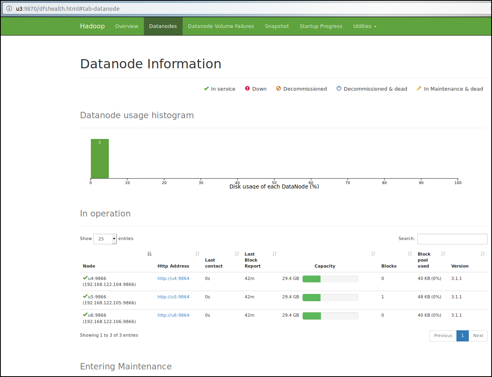

# Hadoop


## Hadoop

```
13:09 # ll /opt/share/software/HadoopEcosystem/hadoop/
total 212
drwxr-xr-x 10 libvirt-qemu henry   4096 Jan  9 16:14 ./
drwxrwxr-x 14 libvirt-qemu henry   4096 Jan 15 04:28 ../
drwxr-xr-x  2 libvirt-qemu henry   4096 Aug  1 22:05 bin/
drwxr-xr-x  3 libvirt-qemu henry   4096 Aug  1 21:28 etc/
drwxr-xr-x  2 libvirt-qemu henry   4096 Aug  1 22:05 include/
drwxr-xr-x  3 libvirt-qemu henry   4096 Aug  1 22:05 lib/
drwxr-xr-x  4 libvirt-qemu henry   4096 Aug  1 22:05 libexec/
-rw-r--r--  1 libvirt-qemu henry 147144 Jul 28 16:13 LICENSE.txt
drwxrwxr-x  3 libvirt-qemu henry   4096 Jan  9 16:38 logs/
-rw-r--r--  1 libvirt-qemu henry  21867 Jul 28 16:13 NOTICE.txt
-rw-r--r--  1 libvirt-qemu henry   1366 Jul 28 13:41 README.txt
drwxr-xr-x  3 libvirt-qemu henry   4096 Aug  1 21:28 sbin/
drwxr-xr-x  4 libvirt-qemu henry   4096 Aug  1 22:17 share/
```

name node: u3  
data node: u4,u5,u6

### prepare for hadoop folders

```
for i in `seq 3 6`; do
ansible u$i -a "rm -fr /opt/hadoop";
done

for i in `seq 3 6`; do
ansible u$i -a "mkdir -p /opt/hadoop/data";
ansible u$i -a "mkdir -p /opt/hadoop/log";
ansible u$i -a "mkdir -p /opt/hadoop/tmp";
ansible u$i -a "mkdir -p /opt/hadoop/mr-history/tmp";
ansible u$i -a "mkdir -p /opt/hadoop/mr-history/done";
done

ansible u3 -a "mkdir -p /opt/hadoop/name";
```

### init namenode

```
$hdfs namenode -format
```

### start or stop hadoop cluster
Start:   

```bash
for i in `seq 3 6`; do virsh start u$i; done
sleep 60 # wait for 60 secs for servers to boot up
ansible u3 -a "start-all.sh";
ansible u3 -a "mapred --daemon start historyserver";
```

Stop:  
```
ansible u3 -a "mapred --daemon stop historyserver";
ansible u3 -a "stop-all.sh";
for i in `seq 3 6`; do virsh shutdown u$i; done
```

[http://u3:8088/cluster](http://u3:8088/cluster)  


[http://u3:9870/](http://u3:9870/)  



### Hadoop streaming

```
$find /opt/share/software/HadoopEcosystem/hadoop/ -name hadoop-streaming*.jar
/opt/share/software/HadoopEcosystem/hadoop/share/hadoop/tools/lib/hadoop-streaming-3.2.0.jar
/opt/share/software/HadoopEcosystem/hadoop/share/hadoop/tools/sources/hadoop-streaming-3.2.0-sources.jar
/opt/share/software/HadoopEcosystem/hadoop/share/hadoop/tools/sources/hadoop-streaming-3.2.0-test-sources.jar
```

```
hdfs dfs -rm -r wc_mr
export HADOOP_STREAMING_JAR=/opt/share/software/HadoopEcosystem/hadoop/share/hadoop/tools/lib/hadoop-streaming-3.2.0.jar
yarn jar $HADOOP_STREAMING_JAR -mapper 'wc -l' -numReduceTasks 0 -input /henry -output wc-mr
```

### upgrade hadoop from 3.1.1 to 3.2.0

download tar ball of hadoop3.2.0 from apache. Setup all config files. and run `start-all.sh`.
