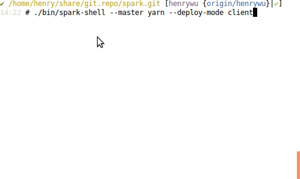
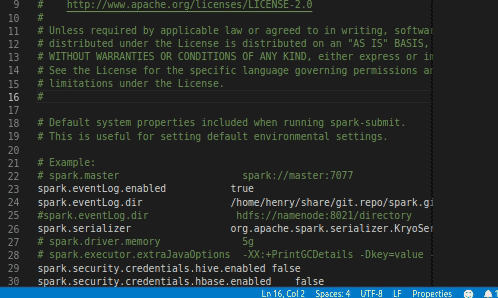
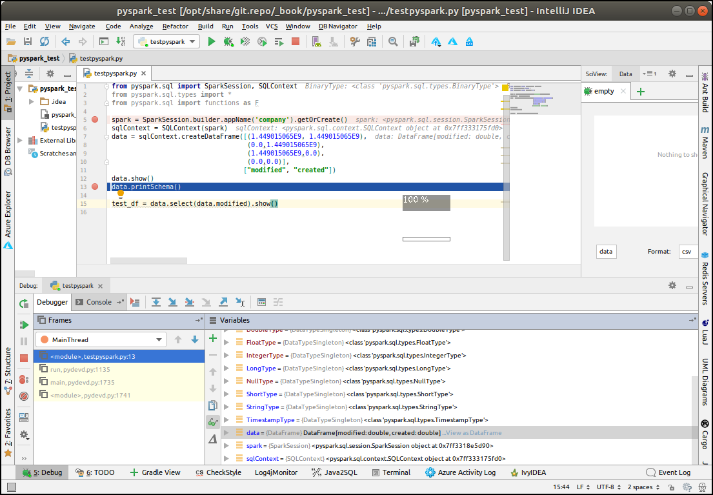

# Spark

[RDD PAPER](pdf/rdd.pdf)

## Production

```
export SPARK_HOME=/opt/share/software/HadoopEcosystem/spark
```
and set conf files.

data: `/opt/share/coursera/Big_Data_Analysis_Hive_Spark_SQL_DataFrames_and_GraphFrames/week4/graphDFSample`

```
d=spark.read.load("file:///opt/share/coursera/Big_Data_Analysis_Hive_Spark_SQL_DataFrames_and_GraphFrames/week4/graphDFSample")
```

## DEV

https://issues.apache.org/jira/browse/SPARK-18673

Spark-hive doesn't support hadoop3.x.

https://spark.apache.org/developer-tools.html#reducing-build-times

Build from source since I could not find spark for hadoop 3.1.1


For normal build this is fine:
```
./build/mvn -DskipTests clean package
```

I use this one:
```
./build/mvn \
  -Psparkr -Phive\
  -Phive-thriftserver -Pmesos -Pyarn \
  -Pkubernetes \
  -Phadoop-3.2 -Dhadoop.version=3.2.0 \
  -DskipTests clean package
```
spark-hive-connector seems not supporting hadoop 3, so remove it from the build command:
```
./build/mvn   -Psparkr   -Pmesos -Pyarn   -Pkubernetes
  -Phadoop-3.2 -Dhadoop.version=3.2.0 -DskipTests 
  -Pbigtop-dist -Psbt -Pspark-ganglia-lgpl -Phadoop-cloud package
...
[INFO] ------------------------------------------------------------------------
[INFO] Reactor Summary for Spark Project Parent POM 3.0.0-SNAPSHOT:
[INFO] 
[INFO] Spark Project Parent POM ........................... SUCCESS [  8.826 s]
[INFO] Spark Project Tags ................................. SUCCESS [ 14.300 s]
[INFO] Spark Project Sketch ............................... SUCCESS [ 13.190 s]
[INFO] Spark Project Local DB ............................. SUCCESS [  6.466 s]
[INFO] Spark Project Networking ........................... SUCCESS [ 13.518 s]
[INFO] Spark Project Shuffle Streaming Service ............ SUCCESS [ 10.571 s]
[INFO] Spark Project Unsafe ............................... SUCCESS [ 19.864 s]
[INFO] Spark Project Launcher ............................. SUCCESS [ 17.397 s]
[INFO] Spark Project Core ................................. SUCCESS [05:05 min]
[INFO] Spark Project ML Local Library ..................... SUCCESS [  9.911 s]
[INFO] Spark Project GraphX ............................... SUCCESS [ 16.971 s]
[INFO] Spark Project Streaming ............................ SUCCESS [ 39.431 s]
[INFO] Spark Project Catalyst ............................. SUCCESS [02:04 min]
[INFO] Spark Project SQL .................................. SUCCESS [06:37 min]
[INFO] Spark Project ML Library ........................... SUCCESS [02:49 min]
[INFO] Spark Project Tools ................................ SUCCESS [  2.844 s]
[INFO] Spark Project Hive ................................. SUCCESS [01:05 min]
[INFO] Spark Project REPL ................................. SUCCESS [  7.124 s]
[INFO] Spark Project YARN Shuffle Service ................. SUCCESS [ 18.103 s]
[INFO] Spark Project YARN ................................. SUCCESS [ 13.632 s]
[INFO] Spark Project Mesos ................................ SUCCESS [  9.339 s]
[INFO] Spark Project Kubernetes ........................... SUCCESS [  9.660 s]
[INFO] Spark Ganglia Integration .......................... SUCCESS [  3.659 s]
[INFO] Spark Project Cloud Integration through Hadoop Libraries SUCCESS [  4.587 s]
[INFO] Spark Project Assembly ............................. SUCCESS [ 27.710 s]
[INFO] Spark Integration for Kafka 0.10 ................... SUCCESS [ 10.741 s]
[INFO] Kafka 0.10+ Token Provider for Streaming ........... SUCCESS [  4.544 s]
[INFO] Kafka 0.10+ Source for Structured Streaming ........ SUCCESS [ 14.702 s]
[INFO] Spark Project Examples ............................. SUCCESS [ 24.841 s]
[INFO] Spark Integration for Kafka 0.10 Assembly .......... SUCCESS [ 18.636 s]
[INFO] Spark Avro ......................................... SUCCESS [  6.891 s]
[INFO] ------------------------------------------------------------------------
[INFO] BUILD SUCCESS
[INFO] ------------------------------------------------------------------------
[INFO] Total time:  23:31 min
[INFO] Finished at: 2019-02-10T13:00:04-08:00
[INFO] ------------------------------------------------------------------------
✔ /home/henry/share/git.repo/spark.git [henrywu|✚ 1…5] 
```


```
[15721][uu][5][bash](09:59:17)[0](root) : /opt/share/git.repo/spark.git
$./build/sbt assembly
Using /opt/share/software/jdk1.8.0_191 as default JAVA_HOME.
Note, this will be overridden by -java-home if it is set.
Attempting to fetch sbt
Launching sbt from build/sbt-launch-0.13.18.jar
[info] Loading global plugins from /home/henry/.sbt/0.13/plugins
[info] Loading project definition from /home/henry/share/git.repo/spark.git/project
[info] Resolving key references (18679 settings) ...
[info] Set current project to spark-parent (in build file:/home/henry/share/git.repo/spark.git/)
[info] Compiling 508 Scala sources and 77 Java sources to /home/henry/share/git.repo/spark.git/core/target/scala-2.12/cl...
...
✔ /opt/share/git.repo/spark.git/dev [henrywu|●1✚ 4…4] 
09:19 # ./make-distribution.sh 
...
[INFO] Reactor Summary for Spark Project Parent POM 3.0.0-SNAPSHOT:
[INFO] 
[INFO] Spark Project Parent POM ........................... SUCCESS [ 12.165 s]
[INFO] Spark Project Tags ................................. SUCCESS [ 12.188 s]
[INFO] Spark Project Sketch ............................... SUCCESS [  9.895 s]
[INFO] Spark Project Local DB ............................. SUCCESS [  6.394 s]
[INFO] Spark Project Networking ........................... SUCCESS [ 12.573 s]
[INFO] Spark Project Shuffle Streaming Service ............ SUCCESS [  7.319 s]
[INFO] Spark Project Unsafe ............................... SUCCESS [ 13.363 s]
[INFO] Spark Project Launcher ............................. SUCCESS [  9.184 s]
[INFO] Spark Project Core ................................. SUCCESS [04:48 min]
[INFO] Spark Project ML Local Library ..................... SUCCESS [  9.002 s]
[INFO] Spark Project GraphX ............................... SUCCESS [ 16.310 s]
[INFO] Spark Project Streaming ............................ SUCCESS [ 39.498 s]
[INFO] Spark Project Catalyst ............................. SUCCESS [02:32 min]
[INFO] Spark Project SQL .................................. SUCCESS [04:13 min]
[INFO] Spark Project ML Library ........................... SUCCESS [02:03 min]
[INFO] Spark Project Tools ................................ SUCCESS [  0.972 s]
[INFO] Spark Project Hive ................................. SUCCESS [ 53.605 s]
[INFO] Spark Project REPL ................................. SUCCESS [  6.058 s]
[INFO] Spark Project Assembly ............................. SUCCESS [  5.842 s]
[INFO] Spark Integration for Kafka 0.10 ................... SUCCESS [  9.744 s]
[INFO] Kafka 0.10+ Token Provider for Streaming ........... SUCCESS [  2.670 s]
[INFO] Kafka 0.10+ Source for Structured Streaming ........ SUCCESS [ 17.177 s]
[INFO] Spark Project Examples ............................. SUCCESS [ 27.661 s]
[INFO] Spark Integration for Kafka 0.10 Assembly .......... SUCCESS [ 15.336 s]
[INFO] Spark Avro ......................................... SUCCESS [ 10.186 s]
[INFO] ------------------------------------------------------------------------
[INFO] BUILD SUCCESS
[INFO] ------------------------------------------------------------------------
[INFO] Total time:  18:37 min
[INFO] Finished at: 2019-02-10T09:19:27-08:00
[INFO] ------------------------------------------------------------------------
+ rm -rf /opt/share/git.repo/spark.git/dist
+ mkdir -p /opt/share/git.repo/spark.git/dist/jars
+ echo 'Spark 1 (git revision 8cd25a0fdb) built for Hadoop null object or invalid expression'
...
09:21 # ll /opt/share/git.repo/spark.git/dist/jars
total 149480
drwxr-xr-x  2 root root    12288 Feb 10 09:19 ./
drwxr-xr-x 13 root root     4096 Feb 10 09:19 ../
-rw-r--r--  1 root root    30035 Feb 10 09:19 accessors-smart-1.2.jar
-rw-r--r--  1 root root    69409 Feb 10 09:19 activation-1.1.1.jar
-rw-r--r--  1 root root   134044 Feb 10 09:19 aircompressor-0.10.jar
-rw-r--r--  1 root root   336803 Feb 10 09:19 antlr4-runtime-4.7.1.jar
-rw-r--r--  1 root root    14766 Feb 10 09:19 aopalliance-repackaged-2.4.0-b34.jar
-rw-r--r--  1 root root  1194003 Feb 10 09:19 arpack_combined_all-0.1.jar
-rw-r--r--  1 root root    59274 Feb 10 09:19 arrow-format-0.12.0.jar
-rw-r--r--  1 root root    83458 Feb 10 09:19 arrow-memory-0.12.0.jar
-rw-r--r--  1 root root  1326772 Feb 10 09:19 arrow-vector-0.12.0.jar
-rw-r--r--  1 root root  1556863 Feb 10 09:19 avro-1.8.2.jar
-rw-r--r--  1 root root   132989 Feb 10 09:19 avro-ipc-1.8.2.jar
-rw-r--r--  1 root root   187052 Feb 10 09:19 avro-mapred-1.8.2-hadoop2.jar
-rw-r--r--  1 root root 13319481 Feb 10 09:19 breeze_2.12-0.13.2.jar
-rw-r--r--  1 root root   125330 Feb 10 09:19 breeze-macros_2.12-0.13.2.jar
-rw-r--r--  1 root root   195811 Feb 10 09:19 chill_2.12-0.9.3.jar
-rw-r--r--  1 root root    58633 Feb 10 09:19 chill-java-0.9.3.jar
-rw-r--r--  1 root root   246174 Feb 10 09:19 commons-beanutils-1.9.3.jar
-rw-r--r--  1 root root    41123 Feb 10 09:19 commons-cli-1.2.jar
-rw-r--r--  1 root root   284184 Feb 10 09:19 commons-codec-1.10.jar
-rw-r--r--  1 root root   588337 Feb 10 09:19 commons-collections-3.2.2.jar
-rw-r--r--  1 root root    37894 Feb 10 09:19 commons-compiler-3.0.11.jar
-rw-r--r--  1 root root   365552 Feb 10 09:19 commons-compress-1.8.1.jar
-rw-r--r--  1 root root   616888 Feb 10 09:19 commons-configuration2-2.1.1.jar
-rw-r--r--  1 root root   134595 Feb 10 09:19 commons-crypto-1.0.0.jar
-rw-r--r--  1 root root   185140 Feb 10 09:19 commons-io-2.4.jar
-rw-r--r--  1 root root   284220 Feb 10 09:19 commons-lang-2.6.jar
-rw-r--r--  1 root root   501879 Feb 10 09:19 commons-lang3-3.8.1.jar
-rw-r--r--  1 root root  2035066 Feb 10 09:19 commons-math3-3.4.1.jar
-rw-r--r--  1 root root   273370 Feb 10 09:19 commons-net-3.1.jar
-rw-r--r--  1 root root   197176 Feb 10 09:19 commons-text-1.6.jar
-rw-r--r--  1 root root    79845 Feb 10 09:19 compress-lzf-1.0.3.jar
-rw-r--r--  1 root root   164422 Feb 10 09:19 core-1.1.2.jar
-rw-r--r--  1 root root    69500 Feb 10 09:19 curator-client-2.7.1.jar
-rw-r--r--  1 root root   186273 Feb 10 09:19 curator-framework-2.7.1.jar
-rw-r--r--  1 root root   270342 Feb 10 09:19 curator-recipes-2.7.1.jar
-rw-r--r--  1 root root   307637 Feb 10 09:19 dnsjava-2.1.7.jar
-rw-r--r--  1 root root    18497 Feb 10 09:19 flatbuffers-java-1.9.0.jar
-rw-r--r--  1 root root   190432 Feb 10 09:19 gson-2.2.4.jar
-rw-r--r--  1 root root  2189117 Feb 10 09:19 guava-14.0.1.jar
-rw-r--r--  1 root root    60244 Feb 10 09:19 hadoop-annotations-3.2.0.jar
-rw-r--r--  1 root root   139058 Feb 10 09:19 hadoop-auth-3.2.0.jar
-rw-r--r--  1 root root    44149 Feb 10 09:19 hadoop-client-3.2.0.jar
-rw-r--r--  1 root root  4092595 Feb 10 09:19 hadoop-common-3.2.0.jar
-rw-r--r--  1 root root  5023516 Feb 10 09:19 hadoop-hdfs-client-3.2.0.jar
-rw-r--r--  1 root root   805832 Feb 10 09:19 hadoop-mapreduce-client-common-3.2.0.jar
-rw-r--r--  1 root root  1656425 Feb 10 09:19 hadoop-mapreduce-client-core-3.2.0.jar
-rw-r--r--  1 root root    85877 Feb 10 09:19 hadoop-mapreduce-client-jobclient-3.2.0.jar
-rw-r--r--  1 root root  3282880 Feb 10 09:19 hadoop-yarn-api-3.2.0.jar
-rw-r--r--  1 root root   317928 Feb 10 09:19 hadoop-yarn-client-3.2.0.jar
-rw-r--r--  1 root root  2897440 Feb 10 09:19 hadoop-yarn-common-3.2.0.jar
-rw-r--r--  1 root root   178947 Feb 10 09:19 hk2-api-2.4.0-b34.jar
-rw-r--r--  1 root root   181271 Feb 10 09:19 hk2-locator-2.4.0-b34.jar
-rw-r--r--  1 root root   118973 Feb 10 09:19 hk2-utils-2.4.0-b34.jar
-rw-r--r--  1 root root  1671083 Feb 10 09:19 hppc-0.7.2.jar
-rw-r--r--  1 root root  1502280 Feb 10 09:19 htrace-core4-4.1.0-incubating.jar
-rw-r--r--  1 root root   767140 Feb 10 09:19 httpclient-4.5.6.jar
-rw-r--r--  1 root root   326356 Feb 10 09:19 httpcore-4.4.10.jar
-rw-r--r--  1 root root  1282424 Feb 10 09:19 ivy-2.4.0.jar
-rw-r--r--  1 root root    66981 Feb 10 09:19 jackson-annotations-2.9.6.jar
-rw-r--r--  1 root root   323848 Feb 10 09:19 jackson-core-2.9.6.jar
-rw-r--r--  1 root root   232248 Feb 10 09:19 jackson-core-asl-1.9.13.jar
-rw-r--r--  1 root root  1349339 Feb 10 09:19 jackson-databind-2.9.6.jar
-rw-r--r--  1 root root    32373 Feb 10 09:19 jackson-jaxrs-base-2.9.5.jar
-rw-r--r--  1 root root    15864 Feb 10 09:19 jackson-jaxrs-json-provider-2.9.5.jar
-rw-r--r--  1 root root   780664 Feb 10 09:19 jackson-mapper-asl-1.9.13.jar
-rw-r--r--  1 root root    32832 Feb 10 09:19 jackson-module-jaxb-annotations-2.9.6.jar
-rw-r--r--  1 root root    42883 Feb 10 09:19 jackson-module-paranamer-2.9.6.jar
-rw-r--r--  1 root root   343926 Feb 10 09:19 jackson-module-scala_2.12-2.9.6.jar
-rw-r--r--  1 root root   847054 Feb 10 09:19 janino-3.0.11.jar
-rw-r--r--  1 root root   714194 Feb 10 09:19 javassist-3.18.1-GA.jar
-rw-r--r--  1 root root    26366 Feb 10 09:19 javax.annotation-api-1.2.jar
-rw-r--r--  1 root root     5950 Feb 10 09:19 javax.inject-2.4.0-b34.jar
-rw-r--r--  1 root root    95806 Feb 10 09:19 javax.servlet-api-3.1.0.jar
-rw-r--r--  1 root root   115534 Feb 10 09:19 javax.ws.rs-api-2.0.1.jar
-rw-r--r--  1 root root   102244 Feb 10 09:19 jaxb-api-2.2.11.jar
-rw-r--r--  1 root root     4722 Feb 10 09:19 jcip-annotations-1.0-1.jar
-rw-r--r--  1 root root    16515 Feb 10 09:19 jcl-over-slf4j-1.7.25.jar
-rw-r--r--  1 root root   167421 Feb 10 09:19 jersey-client-2.22.2.jar
-rw-r--r--  1 root root   698375 Feb 10 09:19 jersey-common-2.22.2.jar
-rw-r--r--  1 root root    18098 Feb 10 09:19 jersey-container-servlet-2.22.2.jar
-rw-r--r--  1 root root    66270 Feb 10 09:19 jersey-container-servlet-core-2.22.2.jar
-rw-r--r--  1 root root   971310 Feb 10 09:19 jersey-guava-2.22.2.jar
-rw-r--r--  1 root root    72733 Feb 10 09:19 jersey-media-jaxb-2.22.2.jar
-rw-r--r--  1 root root   951701 Feb 10 09:19 jersey-server-2.22.2.jar
-rw-r--r--  1 root root   128579 Feb 10 09:19 jetty-webapp-9.4.12.v20180830.jar
-rw-r--r--  1 root root    52044 Feb 10 09:19 jetty-xml-9.4.12.v20180830.jar
-rw-r--r--  1 root root   627814 Feb 10 09:19 joda-time-2.9.3.jar
-rw-r--r--  1 root root    83376 Feb 10 09:19 json4s-ast_2.12-3.5.3.jar
-rw-r--r--  1 root root   489399 Feb 10 09:19 json4s-core_2.12-3.5.3.jar
-rw-r--r--  1 root root    40086 Feb 10 09:19 json4s-jackson_2.12-3.5.3.jar
-rw-r--r--  1 root root   346628 Feb 10 09:19 json4s-scalap_2.12-3.5.3.jar
-rw-r--r--  1 root root   120316 Feb 10 09:19 json-smart-2.3.jar
-rw-r--r--  1 root root   100636 Feb 10 09:19 jsp-api-2.1.jar
-rw-r--r--  1 root root    33031 Feb 10 09:19 jsr305-3.0.0.jar
-rw-r--r--  1 root root   764569 Feb 10 09:19 jtransforms-2.4.0.jar
-rw-r--r--  1 root root     4596 Feb 10 09:19 jul-to-slf4j-1.7.25.jar
-rw-r--r--  1 root root    80980 Feb 10 09:19 kerb-admin-1.0.1.jar
-rw-r--r--  1 root root   113017 Feb 10 09:19 kerb-client-1.0.1.jar
-rw-r--r--  1 root root    65464 Feb 10 09:19 kerb-common-1.0.1.jar
-rw-r--r--  1 root root   226672 Feb 10 09:19 kerb-core-1.0.1.jar
-rw-r--r--  1 root root   116120 Feb 10 09:19 kerb-crypto-1.0.1.jar
-rw-r--r--  1 root root    20046 Feb 10 09:19 kerb-identity-1.0.1.jar
-rw-r--r--  1 root root    82756 Feb 10 09:19 kerb-server-1.0.1.jar
-rw-r--r--  1 root root    20409 Feb 10 09:19 kerb-simplekdc-1.0.1.jar
-rw-r--r--  1 root root    36708 Feb 10 09:19 kerb-util-1.0.1.jar
-rw-r--r--  1 root root   102174 Feb 10 09:19 kerby-asn1-1.0.1.jar
-rw-r--r--  1 root root    30674 Feb 10 09:19 kerby-config-1.0.1.jar
-rw-r--r--  1 root root   204650 Feb 10 09:19 kerby-pkix-1.0.1.jar
-rw-r--r--  1 root root    40554 Feb 10 09:19 kerby-util-1.0.1.jar
-rw-r--r--  1 root root    29134 Feb 10 09:19 kerby-xdr-1.0.1.jar
-rw-r--r--  1 root root   410874 Feb 10 09:19 kryo-shaded-4.0.2.jar
-rw-r--r--  1 root root  1045744 Feb 10 09:19 leveldbjni-all-1.8.jar
-rw-r--r--  1 root root   489884 Feb 10 09:19 log4j-1.2.17.jar
-rw-r--r--  1 root root   511547 Feb 10 09:19 lz4-java-1.5.0.jar
-rw-r--r--  1 root root    33650 Feb 10 09:19 machinist_2.12-0.6.1.jar
-rw-r--r--  1 root root     3180 Feb 10 09:19 macro-compat_2.12-1.1.1.jar
-rw-r--r--  1 root root   120465 Feb 10 09:19 metrics-core-3.1.5.jar
-rw-r--r--  1 root root    21247 Feb 10 09:19 metrics-graphite-3.1.5.jar
-rw-r--r--  1 root root    15824 Feb 10 09:19 metrics-json-3.1.5.jar
-rw-r--r--  1 root root    39283 Feb 10 09:19 metrics-jvm-3.1.5.jar
-rw-r--r--  1 root root     5711 Feb 10 09:19 minlog-1.3.0.jar
-rw-r--r--  1 root root  1330219 Feb 10 09:19 netty-3.9.9.Final.jar
-rw-r--r--  1 root root  3885158 Feb 10 09:19 netty-all-4.1.30.Final.jar
-rw-r--r--  1 root root   299508 Feb 10 09:19 nimbus-jose-jwt-4.41.1.jar
-rw-r--r--  1 root root    54391 Feb 10 09:19 objenesis-2.5.1.jar
-rw-r--r--  1 root root   331034 Feb 10 09:19 okhttp-2.7.5.jar
-rw-r--r--  1 root root    65928 Feb 10 09:19 okio-1.6.0.jar
-rw-r--r--  1 root root    19827 Feb 10 09:19 opencsv-2.3.jar
-rw-r--r--  1 root root  1565376 Feb 10 09:19 orc-core-1.5.4-nohive.jar
-rw-r--r--  1 root root   812220 Feb 10 09:19 orc-mapreduce-1.5.4-nohive.jar
-rw-r--r--  1 root root    27742 Feb 10 09:19 orc-shims-1.5.4.jar
-rw-r--r--  1 root root    65261 Feb 10 09:19 oro-2.0.8.jar
-rw-r--r--  1 root root    20235 Feb 10 09:19 osgi-resource-locator-1.0.1.jar
-rw-r--r--  1 root root    34654 Feb 10 09:19 paranamer-2.8.jar
-rw-r--r--  1 root root  1097799 Feb 10 09:19 parquet-column-1.10.1.jar
-rw-r--r--  1 root root    94995 Feb 10 09:19 parquet-common-1.10.1.jar
-rw-r--r--  1 root root   848750 Feb 10 09:19 parquet-encoding-1.10.1.jar
-rw-r--r--  1 root root   723203 Feb 10 09:19 parquet-format-2.4.0.jar
-rw-r--r--  1 root root   285732 Feb 10 09:19 parquet-hadoop-1.10.1.jar
-rw-r--r--  1 root root  1048171 Feb 10 09:19 parquet-jackson-1.10.1.jar
-rw-r--r--  1 root root   533455 Feb 10 09:19 protobuf-java-2.5.0.jar
-rw-r--r--  1 root root   122939 Feb 10 09:19 py4j-0.10.8.1.jar
-rw-r--r--  1 root root    94796 Feb 10 09:19 pyrolite-4.13.jar
-rw-r--r--  1 root root   128414 Feb 10 09:19 re2j-1.1.jar
-rw-r--r--  1 root root   201928 Feb 10 09:19 RoaringBitmap-0.5.11.jar
-rw-r--r--  1 root root 10508278 Feb 10 09:19 scala-compiler-2.12.8.jar
-rw-r--r--  1 root root  5272591 Feb 10 09:19 scala-library-2.12.8.jar
-rw-r--r--  1 root root   225042 Feb 10 09:19 scala-parser-combinators_2.12-1.1.0.jar
-rw-r--r--  1 root root  3645095 Feb 10 09:19 scala-reflect-2.12.8.jar
-rw-r--r--  1 root root   548430 Feb 10 09:19 scala-xml_2.12-1.0.5.jar
-rw-r--r--  1 root root  2829843 Feb 10 09:19 shapeless_2.12-2.3.2.jar
-rw-r--r--  1 root root    41203 Feb 10 09:19 slf4j-api-1.7.25.jar
-rw-r--r--  1 root root    12244 Feb 10 09:19 slf4j-log4j12-1.7.25.jar
-rw-r--r--  1 root root  2019013 Feb 10 09:19 snappy-java-1.1.7.1.jar
-rw-r--r--  1 root root  7322042 Feb 10 09:19 spark-catalyst_2.12-3.0.0-SNAPSHOT.jar
-rw-r--r--  1 root root  9030915 Feb 10 09:19 spark-core_2.12-3.0.0-SNAPSHOT.jar
-rw-r--r--  1 root root   428738 Feb 10 09:19 spark-graphx_2.12-3.0.0-SNAPSHOT.jar
-rw-r--r--  1 root root    53256 Feb 10 09:19 spark-kvstore_2.12-3.0.0-SNAPSHOT.jar
-rw-r--r--  1 root root    76885 Feb 10 09:19 spark-launcher_2.12-3.0.0-SNAPSHOT.jar
-rw-r--r--  1 root root  5363920 Feb 10 09:19 spark-mllib_2.12-3.0.0-SNAPSHOT.jar
-rw-r--r--  1 root root   101627 Feb 10 09:19 spark-mllib-local_2.12-3.0.0-SNAPSHOT.jar
-rw-r--r--  1 root root  2398657 Feb 10 09:19 spark-network-common_2.12-3.0.0-SNAPSHOT.jar
-rw-r--r--  1 root root    70873 Feb 10 09:19 spark-network-shuffle_2.12-3.0.0-SNAPSHOT.jar
-rw-r--r--  1 root root    51392 Feb 10 09:19 spark-repl_2.12-3.0.0-SNAPSHOT.jar
-rw-r--r--  1 root root    30441 Feb 10 09:19 spark-sketch_2.12-3.0.0-SNAPSHOT.jar
-rw-r--r--  1 root root  5892298 Feb 10 09:19 spark-sql_2.12-3.0.0-SNAPSHOT.jar
-rw-r--r--  1 root root  1150974 Feb 10 09:19 spark-streaming_2.12-3.0.0-SNAPSHOT.jar
-rw-r--r--  1 root root    15249 Feb 10 09:19 spark-tags_2.12-3.0.0-SNAPSHOT.jar
-rw-r--r--  1 root root    50247 Feb 10 09:19 spark-unsafe_2.12-3.0.0-SNAPSHOT.jar
-rw-r--r--  1 root root  9660469 Feb 10 09:19 spire_2.12-0.13.0.jar
-rw-r--r--  1 root root    69702 Feb 10 09:19 spire-macros_2.12-0.13.0.jar
-rw-r--r--  1 root root   161867 Feb 10 09:19 stax2-api-3.1.4.jar
-rw-r--r--  1 root root   174351 Feb 10 09:19 stream-2.7.0.jar
-rw-r--r--  1 root root    18763 Feb 10 09:19 token-provider-1.0.1.jar
-rw-r--r--  1 root root   404970 Feb 10 09:19 univocity-parsers-2.7.3.jar
-rw-r--r--  1 root root    63777 Feb 10 09:19 validation-api-1.1.0.Final.jar
-rw-r--r--  1 root root   512742 Feb 10 09:19 woodstox-core-5.0.3.jar
-rw-r--r--  1 root root   290180 Feb 10 09:19 xbean-asm7-shaded-4.12.jar
-rw-r--r--  1 root root    99555 Feb 10 09:19 xz-1.5.jar
-rw-r--r--  1 root root   792964 Feb 10 09:19 zookeeper-3.4.6.jar
-rw-r--r--  1 root root  2333186 Feb 10 09:19 zstd-jni-1.3.2-2.jar
```

Environmental variables settings:
```bash
#### Spark ####
export SPARK_GIT_HOME=/opt/share/git.repo/spark.git
export SPARK_HOME=/opt/share/git.repo/spark.git/dist
export PATH=$PATH:$SPARK_HOME/bin

export CLASSPATH=.:$SCALA_HOME/lib/*:$CLASSPATH
export CLASSPATH=$CLASSPATH:$SPARK_HOME/jars/*
export CLASSPATH=$CLASSPATH:/home/henry/share/software/db-derby-10.14.2.0-bin/lib/*

# remove duplicates
export PATH=$(printf "%s" "$PATH" | awk -v RS=':' '!a[$1]++ { if (NR > 1) printf RS; printf $1 }')
export CLASSPATH=$(printf "%s" "$CLASSPATH" | awk -v RS=':' '!a[$1]++ { if (NR > 1) printf RS; printf $1 }')

export PYSPARK_DRIVER_PYTHON='ipython'
```


Run Spark with Yarn:  


REF: https://spark.apache.org/docs/latest/building-spark.html


Spark-hive doesn't support hadoop 3. the code is too old.

```
java.lang.IllegalArgumentException: Unrecognized Hadoop major version number: 3.1.1
  at org.apache.hadoop.hive.shims.ShimLoader.getMajorVersion(ShimLoader.java:174)
  at org.apache.hadoop.hive.shims.ShimLoader.loadShims(ShimLoader.java:139)
  at org.apache.hadoop.hive.shims.ShimLoader.getHadoopShims(ShimLoader.java:100)
  at org.apache.hadoop.hive.conf.HiveConf$ConfVars.<clinit>(HiveConf.java:368)
  at org.apache.hadoop.hive.conf.HiveConf.<clinit>(HiveConf.java:105)
  at java.lang.Class.forName0(Native Method)
  at java.lang.Class.forName(Class.java:348)
  at org.apache.spark.util.Utils$.classForName(Utils.scala:195)
  at org.apache.spark.sql.SparkSession$.hiveClassesArePresent(SparkSession.scala:1116)
  at org.apache.spark.repl.Main$.createSparkSession(Main.scala:102)
  ... 57 elided
<console>:14: error: not found: value spark
       import spark.implicits._
              ^
<console>:14: error: not found: value spark
       import spark.sql
              ^
```

- Run spark

```
✔ /opt/share/git.repo/spark.git [henrywu {origin/henrywu}|✔] 
20:07 # SPARK_LOCAL_IP=192.168.122.1 ./bin/spark-shell --master yarn --deploy-mode client
...
Failed to find Spark jars directory (/home/henry/share/git.repo/spark.git/assembly/target/scala-2.11/jars).
You need to build Spark with the target "package" before running this program.
```
After running build:  
```
[INFO] ------------------------------------------------------------------------
[INFO] Reactor Summary for Spark Project Parent POM 3.0.0-SNAPSHOT:
[INFO] 
[INFO] Spark Project Parent POM ........................... SUCCESS [  5.922 s]
[INFO] Spark Project Tags ................................. SUCCESS [ 10.150 s]
[INFO] Spark Project Sketch ............................... SUCCESS [  9.611 s]
[INFO] Spark Project Local DB ............................. SUCCESS [  5.227 s]
[INFO] Spark Project Networking ........................... SUCCESS [ 10.297 s]
[INFO] Spark Project Shuffle Streaming Service ............ SUCCESS [ 11.854 s]
[INFO] Spark Project Unsafe ............................... SUCCESS [ 11.983 s]
[INFO] Spark Project Launcher ............................. SUCCESS [ 10.106 s]
[INFO] Spark Project Core ................................. SUCCESS [03:37 min]
[INFO] Spark Project ML Local Library ..................... SUCCESS [  7.181 s]
[INFO] Spark Project GraphX ............................... SUCCESS [ 12.523 s]
[INFO] Spark Project Streaming ............................ SUCCESS [ 31.369 s]
[INFO] Spark Project Catalyst ............................. SUCCESS [01:46 min]
[INFO] Spark Project SQL .................................. SUCCESS [03:21 min]
[INFO] Spark Project ML Library ........................... SUCCESS [01:47 min]
[INFO] Spark Project Tools ................................ SUCCESS [  0.577 s]
[INFO] Spark Project Hive ................................. SUCCESS [ 43.242 s]
[INFO] Spark Project REPL ................................. SUCCESS [  4.809 s]
[INFO] Spark Project YARN Shuffle Service ................. SUCCESS [ 10.514 s]
[INFO] Spark Project YARN ................................. SUCCESS [ 10.361 s]
[INFO] Spark Project Mesos ................................ SUCCESS [  6.854 s]
[INFO] Spark Project Kubernetes ........................... SUCCESS [  8.368 s]
[INFO] Spark Project Assembly ............................. SUCCESS [  3.979 s]
[INFO] Spark Integration for Kafka 0.10 ................... SUCCESS [  7.962 s]
[INFO] Kafka 0.10+ Source for Structured Streaming ........ SUCCESS [ 11.423 s]
[INFO] Spark Project Examples ............................. SUCCESS [ 16.907 s]
[INFO] Spark Integration for Kafka 0.10 Assembly .......... SUCCESS [ 10.350 s]
[INFO] Spark Avro ......................................... SUCCESS [  4.265 s]
[INFO] ------------------------------------------------------------------------
[INFO] BUILD SUCCESS
[INFO] ------------------------------------------------------------------------
[INFO] Total time:  14:59 min
[INFO] Finished at: 2019-01-15T16:48:36-08:00
[INFO] ------------------------------------------------------------------------
```

### Troubleshooting

```
2019-01-15 22:49:05,733 INFO org.apache.hadoop.yarn.server.resourcemanager.RMAppManager$ApplicationSummary: appId=application_1547609798272_0001,name=Spark shell,user=root,queue=default,state=FINISHED,trackingUrl=http://u3:8088/proxy/application_1547609798272_0001/,appMasterHost=192.168.122.105,submitTime=1547610447422,startTime=1547610448573,finishTime=1547610545418,finalStatus=UNDEFINED,memorySeconds=96574,vcoreSeconds=94,preemptedMemorySeconds=0,preemptedVcoreSeconds=0,preemptedAMContainers=0,preemptedNonAMContainers=0,preemptedResources=<memory:0\, vCores:0>,applicationType=SPARK,resourceSeconds=96574 MB-seconds\, 94 vcore-seconds,preemptedResourceSeconds=0 MB-seconds\, 0 vcore-seconds
```

Found this in data node log:

```
2019-01-15 23:10:35,348 WARN org.apache.hadoop.yarn.server.nodemanager.containermanager.monitor.ContainersMonitorImpl: Container [pid=2313,containerID=container_1547609798272_0002_01_000001] is running 15301120B beyond the 'VIRTUAL' memory limit. Current usage: 151.0 MB of 1 GB physical memory used; 2.1 GB of 2.1 GB virtual memory used. Killing container.
Dump of the process-tree for container_1547609798272_0002_01_000001 :
>.|- PID PPID PGRPID SESSID CMD_NAME USER_MODE_TIME(MILLIS) SYSTEM_TIME(MILLIS) VMEM_USAGE(BYTES) RSSMEM_USAGE(PAGES) FULL_CMD_LINE
>.|- 2313 2311 2313 2313 (bash) 0 1 21856256 874 /bin/bash -c /opt/share/software/jdk1.8.0_191/bin/java -server -Xmx512m -Djava.io.tmpdir=/opt/hadoop/tmp/nm-local-dir/usercache/root/appcache/application_1547609798272_0002/container_1547609798272_0002_01_000001/tmp -Dspark.yarn.app.container.log.dir=/opt/hadoop/log/userlogs/application_1547609798272_0002/container_1547609798272_0002_01_000001 org.apache.spark.deploy.yarn.ExecutorLauncher --arg '192.168.122.1:33869' --properties-file /opt/hadoop/tmp/nm-local-dir/usercache/root/appcache/application_1547609798272_0002/container_1547609798272_0002_01_000001/__spark_conf__/__spark_conf__.properties --dist-cache-conf /opt/hadoop/tmp/nm-local-dir/usercache/root/appcache/application_1547609798272_0002/container_1547609798272_0002_01_000001/__spark_conf__/__spark_dist_cache__.properties 1> /opt/hadoop/log/userlogs/application_1547609798272_0002/container_1547609798272_0002_01_000001/stdout 2> /opt/hadoop/log/userlogs/application_1547609798272_0002/container_1547609798272_0002_01_000001/stderr.
>.|- 2322 2313 2313 2313 (java) 652 405 2248302592 37786 /opt/share/software/jdk1.8.0_191/bin/java -server -Xmx512m -Djava.io.tmpdir=/opt/hadoop/tmp/nm-local-dir/usercache/root/appcache/application_1547609798272_0002/container_1547609798272_0002_01_000001/tmp -Dspark.yarn.app.container.log.dir=/opt/hadoop/log/userlogs/application_1547609798272_0002/container_1547609798272_0002_01_000001 org.apache.spark.deploy.yarn.ExecutorLauncher --arg 192.168.122.1:33869 --properties-file /opt/hadoop/tmp/nm-local-dir/usercache/root/appcache/application_1547609798272_0002/container_1547609798272_0002_01_000001/__spark_conf__/__spark_conf__.properties --dist-cache-conf /opt/hadoop/tmp/nm-local-dir/usercache/root/appcache/application_1547609798272_0002/container_1547609798272_0002_01_000001/__spark_conf__/__spark_dist_cache__.properties.
```

REF:  
https://stackoverflow.com/questions/51237116/understanding-spark-yarn-executor-memoryoverhead  
https://stackoverflow.com/questions/49988475/why-increase-spark-yarn-executor-memoryoverhead  
https://spark.apache.org/docs/latest/configuration.html  


SPARK_LOCAL_IP=192.168.122.1 ./bin/spark-shell --master yarn --deploy-mode client --driver-memory 1G --executor-memory 1G --conf spark.executor.memoryOverhead=348


https://mapr.com/blog/best-practices-yarn-resource-management/  
https://blog.csdn.net/dai451954706/article/details/48828751  
```
    <property>
        <name>yarn.nodemanager.vmem-check-enabled</name>
        <value>false</value>
    </property>   
```



- upload file failed from webui

found this in namenode log:
```
2019-01-15 23:21:35,253 INFO org.apache.hadoop.ipc.Server: IPC Server handler 2 on 9000, call Call#936 Retry#0 org.apache.hadoop.hdfs.protocol.ClientProtocol.create from 192.168.122.106:56178: org.apache.hadoop.security.AccessControlException: Permission denied: user=dr.who, access=WRITE, inode="/test":root:supergroup:drwxr-xr-x
```


https://blog.cloudera.com/blog/2017/12/hadoop-delegation-tokens-explained/

```
05:34 # SPARK_LOCAL_IP=192.168.122.1 ./bin/spark-shell --master yarn --deploy-mode client
2019-01-16 05:34:47 WARN  NativeCodeLoader:60 - Unable to load native-hadoop library for your platform... using builtin-java classes where applicable
Setting default log level to "WARN".
To adjust logging level use sc.setLogLevel(newLevel). For SparkR, use setLogLevel(newLevel).
2019-01-16 05:35:01 WARN  Client:70 - Neither spark.yarn.jars nor spark.yarn.archive is set, falling back to uploading libraries under SPARK_HOME.
2019-01-16 05:35:08 WARN  HBaseDelegationTokenProvider:91 - Fail to invoke HBaseConfiguration
java.lang.ClassNotFoundException: org.apache.hadoop.hbase.HBaseConfiguration
	at scala.reflect.internal.util.AbstractFileClassLoader.findClass(AbstractFileClassLoader.scala:72)
	at java.lang.ClassLoader.loadClass(ClassLoader.java:424)
	at java.lang.ClassLoader.loadClass(ClassLoader.java:357)
	at org.apache.spark.deploy.security.HBaseDelegationTokenProvider.hbaseConf(HBaseDelegationTokenProvider.scala:69)
	at org.apache.spark.deploy.security.HBaseDelegationTokenProvider.delegationTokensRequired(HBaseDelegationTokenProvider.scala:62)
	at org.apache.spark.deploy.security.HadoopDelegationTokenManager.$anonfun$obtainDelegationTokens$1(HadoopDelegationTokenManager.scala:134)
	at scala.collection.TraversableLike.$anonfun$flatMap$1(TraversableLike.scala:244)
	at scala.collection.Iterator.foreach(Iterator.scala:941)
	at scala.collection.Iterator.foreach$(Iterator.scala:941)
	at scala.collection.AbstractIterator.foreach(Iterator.scala:1429)
	at scala.collection.MapLike$DefaultValuesIterable.foreach(MapLike.scala:213)
	at scala.collection.TraversableLike.flatMap(TraversableLike.scala:244)
	at scala.collection.TraversableLike.flatMap$(TraversableLike.scala:241)
	at scala.collection.AbstractTraversable.flatMap(Traversable.scala:108)
	at org.apache.spark.deploy.security.HadoopDelegationTokenManager.obtainDelegationTokens(HadoopDelegationTokenManager.scala:133)
	at org.apache.spark.deploy.yarn.security.YARNHadoopDelegationTokenManager.obtainDelegationTokens(YARNHadoopDelegationTokenManager.scala:59)
	at org.apache.spark.deploy.yarn.Client.setupSecurityToken(Client.scala:305)
	at org.apache.spark.deploy.yarn.Client.createContainerLaunchContext(Client.scala:1014)
	at org.apache.spark.deploy.yarn.Client.submitApplication(Client.scala:181)
	at org.apache.spark.scheduler.cluster.YarnClientSchedulerBackend.start(YarnClientSchedulerBackend.scala:58)
	at org.apache.spark.scheduler.TaskSchedulerImpl.start(TaskSchedulerImpl.scala:184)
	at org.apache.spark.SparkContext.<init>(SparkContext.scala:509)
	at org.apache.spark.SparkContext$.getOrCreate(SparkContext.scala:2466)
	at org.apache.spark.sql.SparkSession$Builder.$anonfun$getOrCreate$5(SparkSession.scala:948)
	at scala.Option.getOrElse(Option.scala:138)
	at org.apache.spark.sql.SparkSession$Builder.getOrCreate(SparkSession.scala:939)
	at org.apache.spark.repl.Main$.createSparkSession(Main.scala:112)
	at $line3.$read$$iw$$iw.<init>(<console>:15)
	at $line3.$read$$iw.<init>(<console>:42)
	at $line3.$read.<init>(<console>:44)
	at $line3.$read$.<init>(<console>:48)
	at $line3.$read$.<clinit>(<console>)
	at $line3.$eval$.$print$lzycompute(<console>:7)
	at $line3.$eval$.$print(<console>:6)
	at $line3.$eval.$print(<console>)
	at sun.reflect.NativeMethodAccessorImpl.invoke0(Native Method)
	at sun.reflect.NativeMethodAccessorImpl.invoke(NativeMethodAccessorImpl.java:62)
	at sun.reflect.DelegatingMethodAccessorImpl.invoke(DelegatingMethodAccessorImpl.java:43)
	at java.lang.reflect.Method.invoke(Method.java:498)
	at scala.tools.nsc.interpreter.IMain$ReadEvalPrint.call(IMain.scala:742)
	at scala.tools.nsc.interpreter.IMain$Request.loadAndRun(IMain.scala:1018)
	at scala.tools.nsc.interpreter.IMain.$anonfun$interpret$1(IMain.scala:574)
	at scala.reflect.internal.util.ScalaClassLoader.asContext(ScalaClassLoader.scala:41)
	at scala.reflect.internal.util.ScalaClassLoader.asContext$(ScalaClassLoader.scala:37)
	at scala.reflect.internal.util.AbstractFileClassLoader.asContext(AbstractFileClassLoader.scala:41)
	at scala.tools.nsc.interpreter.IMain.loadAndRunReq$1(IMain.scala:573)
	at scala.tools.nsc.interpreter.IMain.interpret(IMain.scala:600)
	at scala.tools.nsc.interpreter.IMain.interpret(IMain.scala:570)
	at scala.tools.nsc.interpreter.IMain.$anonfun$quietRun$1(IMain.scala:224)
	at scala.tools.nsc.interpreter.IMain.beQuietDuring(IMain.scala:214)
	at scala.tools.nsc.interpreter.IMain.quietRun(IMain.scala:224)
	at org.apache.spark.repl.SparkILoop.$anonfun$initializeSpark$2(SparkILoop.scala:109)
	at scala.collection.immutable.List.foreach(List.scala:392)
	at org.apache.spark.repl.SparkILoop.$anonfun$initializeSpark$1(SparkILoop.scala:109)
	at scala.runtime.java8.JFunction0$mcV$sp.apply(JFunction0$mcV$sp.java:23)
	at scala.tools.nsc.interpreter.ILoop.savingReplayStack(ILoop.scala:100)
	at org.apache.spark.repl.SparkILoop.initializeSpark(SparkILoop.scala:109)
	at org.apache.spark.repl.SparkILoop.$anonfun$process$5(SparkILoop.scala:211)
	at scala.runtime.java8.JFunction0$mcV$sp.apply(JFunction0$mcV$sp.java:23)
	at scala.tools.nsc.interpreter.ILoop.$anonfun$mumly$1(ILoop.scala:169)
	at scala.tools.nsc.interpreter.IMain.beQuietDuring(IMain.scala:214)
	at scala.tools.nsc.interpreter.ILoop.mumly(ILoop.scala:166)
	at org.apache.spark.repl.SparkILoop.loopPostInit$1(SparkILoop.scala:199)
	at org.apache.spark.repl.SparkILoop.$anonfun$process$11(SparkILoop.scala:267)
	at org.apache.spark.repl.SparkILoop.withSuppressedSettings$1(SparkILoop.scala:235)
	at org.apache.spark.repl.SparkILoop.startup$1(SparkILoop.scala:247)
	at org.apache.spark.repl.SparkILoop.$anonfun$process$1(SparkILoop.scala:282)
	at org.apache.spark.repl.SparkILoop.runClosure(SparkILoop.scala:164)
	at org.apache.spark.repl.SparkILoop.process(SparkILoop.scala:182)
	at org.apache.spark.repl.Main$.doMain(Main.scala:78)
	at org.apache.spark.repl.Main$.main(Main.scala:58)
	at org.apache.spark.repl.Main.main(Main.scala)
	at sun.reflect.NativeMethodAccessorImpl.invoke0(Native Method)
	at sun.reflect.NativeMethodAccessorImpl.invoke(NativeMethodAccessorImpl.java:62)
	at sun.reflect.DelegatingMethodAccessorImpl.invoke(DelegatingMethodAccessorImpl.java:43)
	at java.lang.reflect.Method.invoke(Method.java:498)
	at org.apache.spark.deploy.JavaMainApplication.start(SparkApplication.scala:52)
	at org.apache.spark.deploy.SparkSubmit.org$apache$spark$deploy$SparkSubmit$$runMain(SparkSubmit.scala:854)
	at org.apache.spark.deploy.SparkSubmit.doRunMain$1(SparkSubmit.scala:168)
	at org.apache.spark.deploy.SparkSubmit.submit(SparkSubmit.scala:196)
	at org.apache.spark.deploy.SparkSubmit.doSubmit(SparkSubmit.scala:87)
	at org.apache.spark.deploy.SparkSubmit$$anon$2.doSubmit(SparkSubmit.scala:933)
	at org.apache.spark.deploy.SparkSubmit$.main(SparkSubmit.scala:942)
	at org.apache.spark.deploy.SparkSubmit.main(SparkSubmit.scala)
Spark context Web UI available at http://192.168.122.1:4040
Spark context available as 'sc' (master = yarn, app id = application_1547644510496_0002).
Spark session available as 'spark'.
Welcome to
      ____              __
     / __/__  ___ _____/ /__
    _\ \/ _ \/ _ `/ __/  '_/
   /___/ .__/\_,_/_/ /_/\_\   version 3.0.0-SNAPSHOT
      /_/
         
Using Scala version 2.12.8 (Java HotSpot(TM) 64-Bit Server VM, Java 1.8.0_191)
Type in expressions to have them evaluated.
Type :help for more information.

scala> :q
```


`SPARK_LOCAL_IP=192.168.122.1 spark-submit --master yarn --deploy-mode client src/python/WordCount.py`

```
07:24 # cat src/python/WordCount.py 
import sys
from pyspark import SparkContext
if __name__ == "__main__":
    #master = "local"
    master = "yarn"
    print(sys.argv)
    if len(sys.argv) == 2:
        master = sys.argv[1]
    sc = SparkContext(master, "WordCount")
    lines = sc.parallelize(["pandas", "i like pandas"])
    result = lines.flatMap(lambda x: x.split(" ")).countByValue()
    for key, value in result.iteritems():
        print "%s %i" % (key, value)
```


```
[14238][uu][5][bash](14:54:13)[0](root) : ~/articles
$export PYSPARK_DRIVER_PYTHON='ipython'
[14239][uu][5][bash](14:54:37)[0](root) : ~/articles
$SPARK_LOCAL_IP=192.168.122.1 pyspark --master yarn --deploy-mode client
Python 2.7.15rc1 (default, Nov 12 2018, 14:31:15) 
Type "copyright", "credits" or "license" for more information.

IPython 5.5.0 -- An enhanced Interactive Python.
?         -> Introduction and overview of IPython's features.
%quickref -> Quick reference.
help      -> Python's own help system.
object?   -> Details about 'object', use 'object??' for extra details.
2019-02-07 14:54:43 WARN  NativeCodeLoader:60 - Unable to load native-hadoop library for your platform... using builtin-java classes where applicable
Setting default log level to "WARN".
To adjust logging level use sc.setLogLevel(newLevel). For SparkR, use setLogLevel(newLevel).
2019-02-07 14:54:47 WARN  Client:70 - Neither spark.yarn.jars nor spark.yarn.archive is set, falling back to uploading libraries under SPARK_HOME.
Welcome to
      ____              __
     / __/__  ___ _____/ /__
    _\ \/ _ \/ _ `/ __/  '_/
   /__ / .__/\_,_/_/ /_/\_\   version 3.0.0-SNAPSHOT
      /_/

Using Python version 2.7.15rc1 (default, Nov 12 2018 14:31:15)
SparkSession available as 'spark'.

In [1]: 
```

## GraphX and GraphFrames

[PAPER](pdf/graphframes.pdf)

GraphX is the graph processing component built into Spark since February 2014 (Spark 0.9). It uses the legacy RDD API, which has been with the project since the very beginning.

GraphFrames is a new graph processing library based on GraphX. It is a separate package released in 2016. It uses the DataFrame API, which has several significant advantages:

First, DataFrames are generally more efficient than RDDs; exposing a schema to the underlying system allows many new optimizations like skipping columns when reading data. This makes GraphFrames faster than its predecessor.

Second, the API in GraphFrames allows users to express their computations in terms of queries. For many users this is a more intuitive way to reason about their data. The API is also uniform across Scala, Java and Python, which is not the case for GraphX.

Third, GraphFrames integrate nicely with the DataFrame data sources API. This allows the user to read or write files describing their graphs in json, csv, parquet and many other formats.

GraphFrames also comes with new features, such as breadth first search and motif finding. The latter is particularly powerful; you can use it to find patterns like A -> B <- C easily.

The only reason why GraphFrames didn't just replace GraphX was to maintain legacy API compatibility, but that's about it. If you’re integrating with legacy code, you can always convert your GraphFrames graph back into a GraphX graph, but not the other way round.

TLDR; use GraphFrames over GraphX. It's newer, faster, more powerful, and easier to use. You can read all about it here: Introducing GraphFrames

```scala
$SPARK_LOCAL_IP=192.168.122.1 spark-shell --packages graphframes:graphframes:0.7.0-spark2.4-s_2.11  --master yarn --deploy-mode client
Ivy Default Cache set to: /root/.ivy2/cache
The jars for the packages stored in: /root/.ivy2/jars
:: loading settings :: url = jar:file:/home/henry/share/git.repo/spark.git/assembly/target/scala-2.12/jars/ivy-2.4.0.jar!/org/apache/ivy/core/settings/ivysettings.xml
graphframes#graphframes added as a dependency
:: resolving dependencies :: org.apache.spark#spark-submit-parent-e522d3a7-a396-4034-b71c-52a23e7c67dc;1.0
	confs: [default]
	found graphframes#graphframes;0.7.0-spark2.4-s_2.11 in spark-packages
	found org.slf4j#slf4j-api;1.7.16 in spark-list
:: resolution report :: resolve 327ms :: artifacts dl 9ms
	:: modules in use:
	graphframes#graphframes;0.7.0-spark2.4-s_2.11 from spark-packages in [default]
	org.slf4j#slf4j-api;1.7.16 from spark-list in [default]
	---------------------------------------------------------------------
	|                  |            modules            ||   artifacts   |
	|       conf       | number| search|dwnlded|evicted|| number|dwnlded|
	---------------------------------------------------------------------
	|      default     |   2   |   0   |   0   |   0   ||   2   |   0   |
	---------------------------------------------------------------------
:: retrieving :: org.apache.spark#spark-submit-parent-e522d3a7-a396-4034-b71c-52a23e7c67dc
	confs: [default]
	0 artifacts copied, 2 already retrieved (0kB/11ms)
2019-02-09 07:56:42 WARN  NativeCodeLoader:60 - Unable to load native-hadoop library for your platform... using builtin-java classes where applicable
Setting default log level to "WARN".
To adjust logging level use sc.setLogLevel(newLevel). For SparkR, use setLogLevel(newLevel).
2019-02-09 07:56:56 WARN  Client:69 - Neither spark.yarn.jars nor spark.yarn.archive is set, falling back to uploading libraries under SPARK_HOME.
Spark context Web UI available at http://uu:4040
Spark context available as 'sc' (master = yarn, app id = application_1549718320976_0002).
Spark session available as 'spark'.
Welcome to
      ____              __
     / __/__  ___ _____/ /__
    _\ \/ _ \/ _ `/ __/  '_/
   /___/ .__/\_,_/_/ /_/\_\   version 3.0.0-SNAPSHOT
      /_/
         
Using Scala version 2.12.8 (Java HotSpot(TM) 64-Bit Server VM, Java 1.8.0_191)
Type in expressions to have them evaluated.
Type :help for more information.

scala> 
```

- kill a spark job

`yarn application -kill application_1549747463877_0002`

- optimize launch

```
hdfs dfs -put /opt/share/git.repo/spark.git/assembly/target/scala-2.12/jars /sparkjars
```

then add `spark.yarn.jars hdfs://u3:9000/sparkjars/jars/*` to `conf/spark-defaults.conf`.


## debug





## Others

From my understanding, createTempView (or more appropriately createOrReplaceTempView) has been introduced in Spark 2.0 to replace registerTempTable, which has been deprecated in 2.0. CreateTempView creates an in memory reference to the Dataframe in use. The lifetime for this is tied to the spark session in which the Dataframe was created in. createGlobalTempView (which is not present in 2.0 but is added in 2.1.0) on the other hand allows you to create the references that can be used across spark sessions. So depending upon whether you need to share data across sessions, you can use either of the methods. Ideally your notebooks in same cluster share the same spark session, but there is an option to setup clusters where each notebook has its own session. So all it boils down to is that where do you create the data frame and where do you want to access it.

## Docker

```
docker pull bigdatateam/spark-course2
mkdir notebooks
chmod 777 notebooks
export DOCKER_IMAGE=bigdatateam/spark-course2
docker run -w /tmp/notebooks -v $(pwd)/notebooks:/tmp/notebooks --rm -p 127.0.0.1:8888:8888 $DOCKER_IMAGE sh -c 'jupyter notebook --ip=0.0.0.0 --no-browser --notebook-dir=/tmp/notebooks'
```


