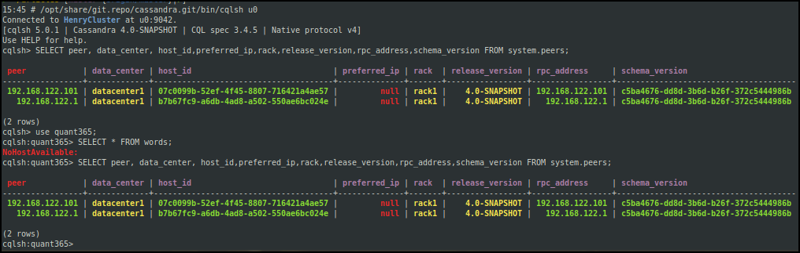
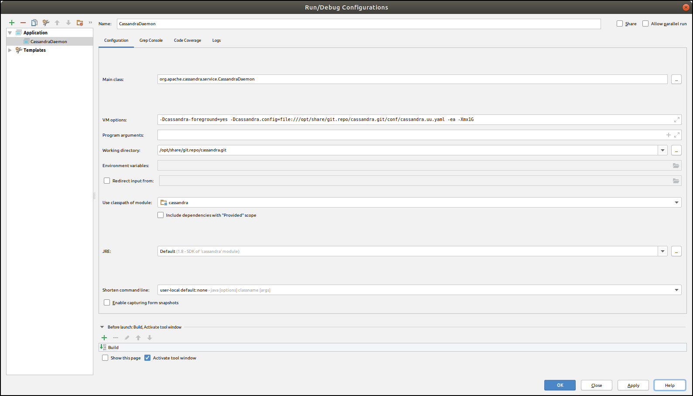
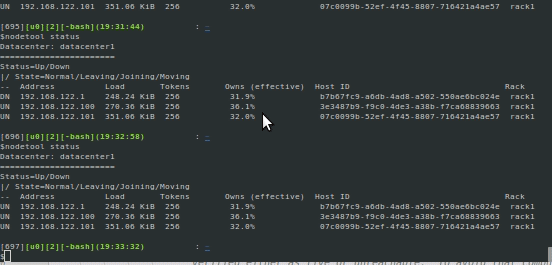
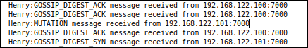
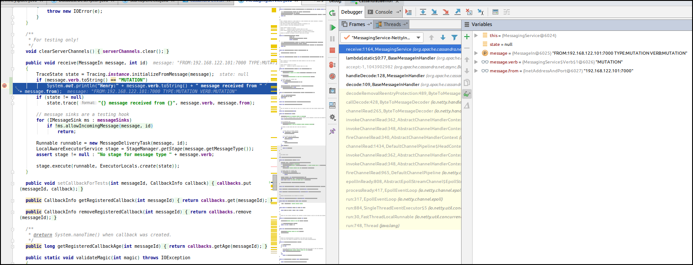

# Cassandra

`sss 2`

## Cluster setup

Start virtual machines:

```
for i in `seq 0 1`; do virsh start u$i; done
```

Three nodes: `uu`, `u0`(seed), `u1`

debug at `uu`

Log into virtual machines and start cassandra command in foreground:

at uu:

```
[12108][uu][0][bash](15:10:39)[0](root) : /home/henry/share/git.repo/cassandra.git
$cassandra -Rf -Dcassandra.config=file:////opt/share/git.repo/cassandra.git/conf/cassandra.uu.yaml
```

at u0:

```
ssh u0
[12108][u0][0][bash](15:10:39)[0](root) : /home/henry/share/git.repo/cassandra.git
$cassandra -Rf -Dcassandra.config=file:////opt/share/git.repo/cassandra.git/conf/cassandra.u0.yaml
```

Some warnings:
```
WARN  [main] 2019-01-28 10:08:28,234 SigarLibrary.java:174 - Cassandra server running in degraded mode. Is swap disabled? : false,  Address space adequate? : true,  nofile limit adequate? : true, nproc limit adequate? : false 
WARN  [main] 2019-01-28 10:08:28,266 StartupChecks.java:310 - Maximum number of memory map areas per process (vm.max_map_count) 65530 is too low, recommended value: 1048575, you can change it with sysctl.
```

at u1:
```
ssh u1
[12108][u1][0][bash](15:10:39)[0](root) : /home/henry/share/git.repo/cassandra.git
$cassandra -Rf -Dcassandra.config=file:////opt/share/git.repo/cassandra.git/conf/cassandra.u1.yaml
```

Check status:

```
$nodetool status
Datacenter: datacenter1
=======================
Status=Up/Down
|/ State=Normal/Leaving/Joining/Moving
--  Address          Load       Tokens       Owns (effective)  Host ID                               Rack
UN  192.168.122.1    341.26 KiB  256          31.9%             b7b67fc9-a6db-4ad8-a502-550ae6bc024e  rack1
UN  192.168.122.100  349.42 KiB  256          36.1%             3e3487b9-f9c0-4de3-a38b-f7ca68839663  rack1
UN  192.168.122.101  199.64 KiB  256          32.0%             07c0099b-52ef-4f45-8807-716421a4ae57  rack1
```

```
15:40 # /opt/share/git.repo/cassandra.git/bin/cqlsh uu
Connected to HenryCluster at uu:9042.
[cqlsh 5.0.1 | Cassandra 4.0-SNAPSHOT | CQL spec 3.4.5 | Native protocol v4]
Use HELP for help.
cqlsh> SELECT peer, data_center, host_id,preferred_ip,rack,release_version,rpc_address,schema_version FROM system.peers;

 peer            | data_center | host_id                              | preferred_ip | rack  | release_version | rpc_address     | schema_version
-----------------+-------------+--------------------------------------+--------------+-------+-----------------+-----------------+--------------------------------------
 192.168.122.101 | datacenter1 | 07c0099b-52ef-4f45-8807-716421a4ae57 |         null | rack1 |    4.0-SNAPSHOT | 192.168.122.101 | c5ba4676-dd8d-3b6d-b26f-372c5444986b
 192.168.122.100 | datacenter1 | 3e3487b9-f9c0-4de3-a38b-f7ca68839663 |         null | rack1 |    4.0-SNAPSHOT | 192.168.122.100 | c5ba4676-dd8d-3b6d-b26f-372c5444986b

(2 rows)
```

## Tests

- stop uu's cassandra and query



it seems the node is still in system.peers table. but my query failed.

check log in u0:
```
INFO  [GossipStage:1] 2019-01-26 18:44:51,135 Gossiper.java:1125 - InetAddress 192.168.122.1:7000 is now DOWN
```

Check with nodetool:

```
$nodetool status
Datacenter: datacenter1
=======================
Status=Up/Down
|/ State=Normal/Leaving/Joining/Moving
--  Address          Load       Tokens       Owns (effective)  Host ID                               Rack
DN  192.168.122.1    341.26 KiB  256          31.9%             b7b67fc9-a6db-4ad8-a502-550ae6bc024e  rack1
UN  192.168.122.100  349.42 KiB  256          36.1%             3e3487b9-f9c0-4de3-a38b-f7ca68839663  rack1
UN  192.168.122.101  199.64 KiB  256          32.0%             07c0099b-52ef-4f45-8807-716421a4ae57  rack1
```

Start ide, VM options:

change 
```
-Dcassandra-foreground=yes
-Dcassandra.config=file:///opt/share/git.repo/cassandra.git/conf/cassandra.uu.yaml
-Dcassandra.storagedir=/opt/share/git.repo/cassandra.git/data
-Dlogback.configurationFile=file:///opt/share/git.repo/cassandra.git/conf/logback.xml
-Dcassandra.logdir=/opt/share/git.repo/cassandra.git/data/logs
-ea
-Xmx1G
```

to 

```
-Dcassandra-foreground=yes
-Dcassandra.config=file:///opt/share/git.repo/cassandra.git/conf/cassandra.uu.yaml
-ea
-Xmx1G
```




connect to `cqlsh`:

```
/opt/share/git.repo/cassandra.git/bin/cqlsh u0
```


Cassandra inter-node ports
```
Port number.	Description
7000	Cassandra inter-node cluster communication.
7001	Cassandra SSL inter-node cluster communication.
7199	Cassandra JMX monitoring port.
```

Cassandra client ports

```
Port number.	Description
9042	Cassandra client port.
9160	Cassandra client port (Thrift).
9142	Default for native_transport_port_ssl, useful when both encrypted and unencrypted connections are required
```




Create a keyspace named `s` with replication factor equal to 2.

```
create keyspace s with replication ={'class':'SimpleStrategy','replication_factor':2};
```


Change replication factor:
```
cqlsh:s> select * from words order by word;
InvalidRequest: Error from server: code=2200 [Invalid query] message="ORDER BY is only supported when the partition key is restricted by an EQ or an IN."
cqlsh:s> ALTER KEYSPACE "s" WITH REPLICATION =  { 'class' : 'SimpleStrategy', 'replication_factor' : 3 };

Warnings :
When increasing replication factor you need to run a full (-full) repair to distribute the data.
```

`nodetool repair -full`


## Write path

StorageProxy(org/apache/cassandra/service/StorageProxy.java) gets the nodes responsible for replicas of the keys from the **ReplicationStrategy**, then sends RowMutation messages to them.

If nodes are changing position on the ring, "pending ranges" are associated with their destinations in `TokenMetadata` and these are also written to.

~~ConsistencyLevel determines how many replies to wait for. See WriteResponseHandler.determineBlockFor. Interaction with pending ranges is a bit tricky; see https://issues.apache.org/jira/browse/CASSANDRA-833~~

If the **FailureDetector**(org/apache/cassandra/gms/FailureDetector.java) says that we don't have enough nodes alive to satisfy the ConsistencyLevel, we fail the request with UnavailableException

When performing __atomic batches__, the mutations are written to the batchlog on two live nodes in the local datacenter. If the local datacenter contains multiple racks, the nodes will be chosen from two separate racks that are different from the coordinator's rack, when possible. If only one other node is alive, it alone will be used, but if no other nodes are alive, an UnavailableException will be returned unless the consistency level is ANY. If the cluster has only one node, it will write the batchlog entry itself. ~~The batchlog is contained in the `system.batchlog` table.~~

If the **FailureDetector** gives us the okay but writes time out anyway because of a failure after the request is sent or because of an overload scenario, **StorageProxy** will write a "hint" locally to replay the write when the replica(s) timing out recover. This is called __HintedHandoff__. Note that HH does not prevent inconsistency entirely; either unclean shutdown or hardware failure can prevent the coordinating node from writing or replaying the hint. ArchitectureAntiEntropy is responsible for restoring consistency more completely.

Cross-datacenter writes are not sent directly to each replica; instead, they are sent to a single replica with a parameter in MessageOut telling that replica to forward to the other replicas in that datacenter; those replicas will respond diectly to the **original** coordinator. 


REF:

http://cassandra.apache.org/blog/2018/12/03/introducing-transient-replication.html

http://cassandra.apache.org/blog/2018/08/07/faster_streaming_in_cassandra.html

https://en.wikipedia.org/wiki/Ford%E2%80%93Fulkerson_algorithm

https://issues.apache.org/jira/projects/CASSANDRA/issues/CASSANDRA-14404


https://medium.com/jorgeacetozi/cassandra-architecture-and-write-path-anatomy-51e339bcfe0c


```
    public static void sendToHintedReplicas(final Mutation mutation,
                                            ReplicaPlan.ForTokenWrite plan,
                                            AbstractWriteResponseHandler<IMutation> responseHandler,
                                            String localDataCenter,
                                            Stage stage)
    throws OverloadedException
    {
```

heavily called functions:

```
    public void sendOneWay(MessageOut message, int id, InetAddressAndPort to)
    {
        if (logger.isTraceEnabled())
            logger.trace("{} sending {} to {}@{}", FBUtilities.getBroadcastAddressAndPort(), message.verb, id, to);

        if (to.equals(FBUtilities.getBroadcastAddressAndPort()))
            logger.trace("Message-to-self {} going over MessagingService", message);

        // message sinks are a testing hook
        for (IMessageSink ms : messageSinks)
            if (!ms.allowOutgoingMessage(message, id, to))
                return;

        OutboundMessagingPool outboundMessagingPool = getMessagingConnection(to);
        if (outboundMessagingPool != null)
            outboundMessagingPool.sendMessage(message, id);
    }

...
    public void receive(MessageIn message, int id)
    {
        TraceState state = Tracing.instance.initializeFromMessage(message);
        if (state != null)
            state.trace("{} message received from {}", message.verb, message.from);

        // message sinks are a testing hook
        for (IMessageSink ms : messageSinks)
            if (!ms.allowIncomingMessage(message, id))
                return;

        Runnable runnable = new MessageDeliveryTask(message, id);
        LocalAwareExecutorService stage = StageManager.getStage(message.getMessageType());
        assert stage != null : "No stage for message type " + message.verb;

        stage.execute(runnable, ExecutorLocals.create(state));
    }
```




