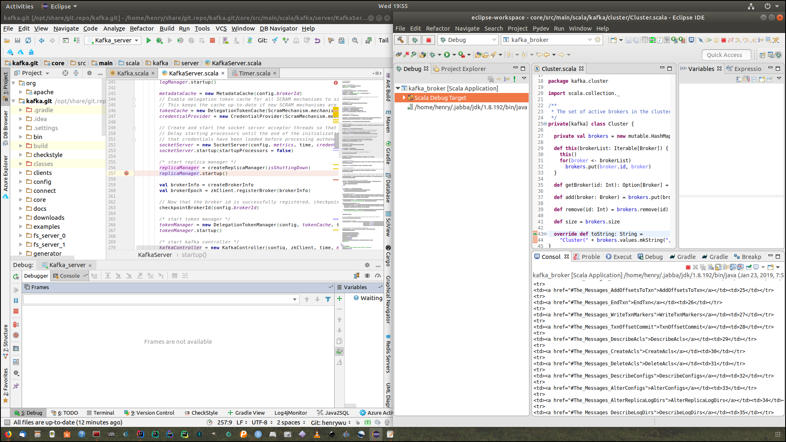

# kafka


---





arguments for kafka server, which you can override in command line:


Create topics:

```
bin/kafka-topics.sh --create --zookeeper localhost:2181 \
  --replication-factor 2 --partitions 2 --topic news
```