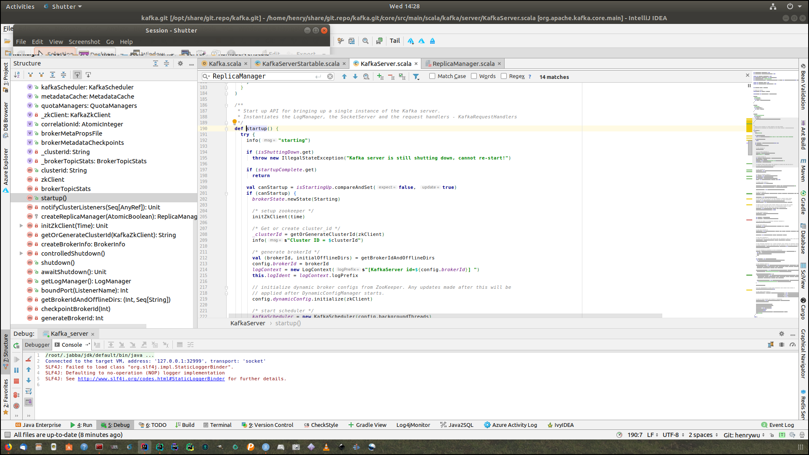
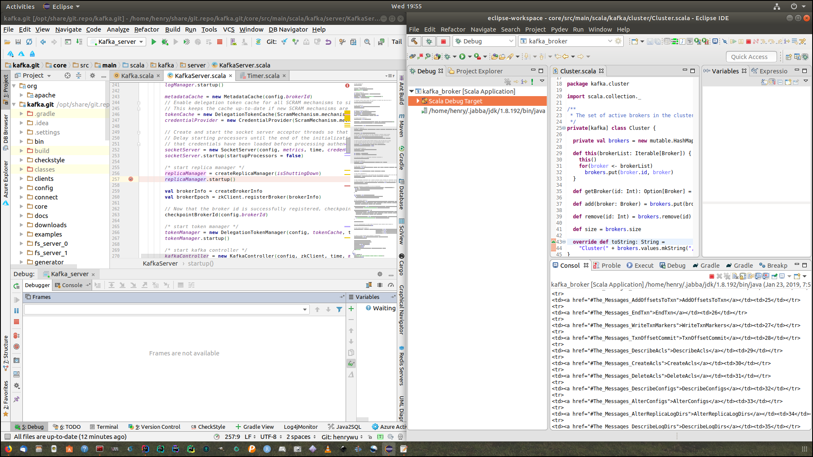
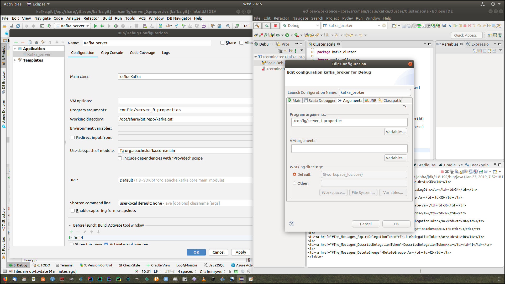
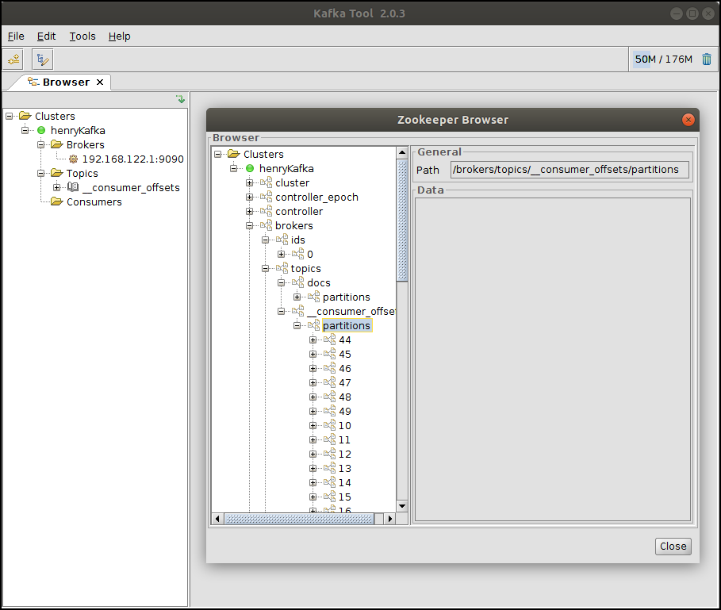
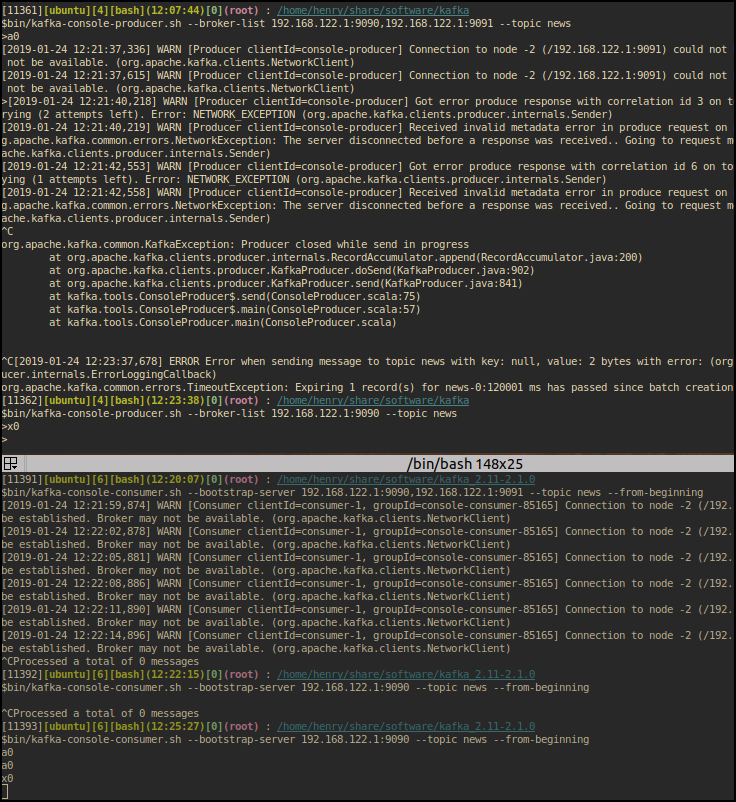
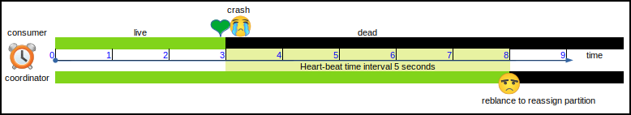
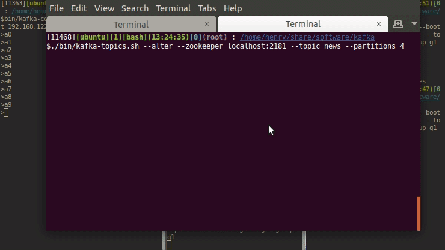

# kafka

# How to debug kafka

```bash
✔ /opt/share/git.repo/kafka.git [henrywu {origin/henrywu}|✔] 
12:23 # ./bin/zookeeper-server-start.sh config/zookeeper.properties 
```

Use this ppa to update gradle:

```rust
sudo add-apt-repository ppa:cwchien/gradle
sudo apt-get update
sudo apt upgrade gradle
```


```bash
bin/kafka-topics.sh --create --zookeeper localhost:2181 \
  --replication-factor 2 --partitions 2 --topic news
```


```rust
14:01 # gp '^project(' build.gradle 
571:project(':core') {
815:project(':examples') {
831:project(':generator') {
848:project(':clients') {
970:project(':tools') {
1021:project(':streams') {
1084:project(':streams:streams-scala') {
1126:project(':streams:test-utils') {
1159:project(':streams:examples') {
1189:project(':streams:upgrade-system-tests-0100') {
1201:project(':streams:upgrade-system-tests-0101') {
1213:project(':streams:upgrade-system-tests-0102') {
1225:project(':streams:upgrade-system-tests-0110') {
1237:project(':streams:upgrade-system-tests-10') {
1249:project(':streams:upgrade-system-tests-11') {
1261:project(':streams:upgrade-system-tests-20') {
1273:project(':streams:upgrade-system-tests-21') {
1285:project(':jmh-benchmarks') {
1327:project(':log4j-appender') {
1345:project(':connect:api') {
1382:project(':connect:transforms') {
1420:project(':connect:json') {
1460:project(':connect:runtime') {
1555:project(':connect:file') {
1593:project(':connect:basic-auth-extension') {
```

It is ok to use old client to connect to new server:


```rust
[11034][ubuntu][5][bash](15:24:19)[0](root) : /home/henry/share/software/kafka
$./bin/kafka-topics.sh --list \
--zookeeper localhost:2181
news
[11035][ubuntu][5][bash](15:35:25)[0](root) : /home/henry/share/software/kafka
$./bin/kafka-topics.sh --create --zookeeper localhost:2181  \
 --replication-factor 2 --partitions 2 --topic news2
Error while executing topic command : Replication factor: 2 larger than 
available brokers: 1.
[2019-01-23 15:35:44,814] ERROR org.apache.kafka.common.errors.InvalidReplicationFactorException:
 Replication factor: 2 larger than available brokers: 1.
 (kafka.admin.TopicCommand$)
```

But you cannot run different version's broker at the same time:
```rust
[2019-01-23 15:11:50,987] ERROR Exception while processing request from 
192.168.122.1:9093-192.168.122.1:51536-20 (kafka.network.Processor)
org.apache.kafka.common.errors.InvalidRequestException: Error getting request for apiKey: 
UPDATE_METADATA, apiVersion: 5, connectionId: 192.168.122.1:9093-192.168.122.1:51536-20, 
listenerName: ListenerName(PLAINTEXT), principal: User:ANONYMOUS
Caused by: java.lang.IllegalArgumentException: Invalid version for API key UPDATE_METADATA: 5
	at org.apache.kafka.common.protocol.ApiKeys.schemaFor(ApiKeys.java:312)
	at org.apache.kafka.common.protocol.ApiKeys.requestSchema(ApiKeys.java:282)
	at org.apache.kafka.common.protocol.ApiKeys.parseRequest(ApiKeys.java:290)
	at org.apache.kafka.common.requests.RequestContext.parseRequest(RequestContext.java:63)
	at kafka.network.RequestChannel$Request.<init>(RequestChannel.scala:89)
	at kafka.network.Processor$$anonfun$processCompletedReceives$1.apply(SocketServer.scala:707)
	at kafka.network.Processor$$anonfun$processCompletedReceives$1.apply(SocketServer.scala:699)
	at scala.collection.Iterator$class.foreach(Iterator.scala:891)
	at scala.collection.AbstractIterator.foreach(Iterator.scala:1334)
	at scala.collection.IterableLike$class.foreach(IterableLike.scala:72)
	at scala.collection.AbstractIterable.foreach(Iterable.scala:54)
	at kafka.network.Processor.processCompletedReceives(SocketServer.scala:699)
	at kafka.network.Processor.run(SocketServer.scala:595)
	at java.lang.Thread.run(Thread.java:748)
```


Ref:

https://manasvigupta.github.io/getting-started-with-contributing-to-apache-kafka-part1-build-and-run-kafka-from-source-code/
https://cwiki.apache.org/confluence/display/KAFKA/Developer+Setup


Because IntelliJ cannot start two instances at the same time, I am using both IntelliJ and Eclipse to debug kafka cluster.

Broker id is tied with FS:
```
[2019-01-23 20:18:16,381] ERROR Fatal error during KafkaServer startup. 
Prepare to shutdown (kafka.server.KafkaServer:159)
kafka.common.InconsistentBrokerIdException: Configured broker.id 0 doesn't 
match stored broker.id 1 in meta.properties. 
If you moved your data, make sure your configured broker.id matches. If you 
intend to create a new broker, you should 
remove all data in your data directories (log.dirs).
	at kafka.server.KafkaServer.getBrokerIdAndOfflineDirs(KafkaServer.scala:710)
	at kafka.server.KafkaServer.startup(KafkaServer.scala:212)
	at kafka.server.KafkaServerStartable.startup(KafkaServerStartable.scala:38)
	at kafka.Kafka$.main(Kafka.scala:75)
	at kafka.Kafka.main(Kafka.scala)
[2019-01-23 20:18:16,422] ERROR Exiting Kafka. (kafka.server.KafkaServerStartable:143)
```
I have to remove all files:
```
rm -f fs_server_*
```

launch parameters:


```
[-daemon] server.properties [--override property=value]*
```


---






arguments for kafka server, which you can override in command line:


Create topics:

```
bin/kafka-topics.sh --create --zookeeper localhost:2181 \
  --replication-factor 2 --partitions 2 --topic news
```

```
✔ /opt/share/git.repo/kafka.git [henrywu {origin/henrywu}|✚ 1] 
10:39 # tree fs_server_*
fs_server_0
├── cleaner-offset-checkpoint
├── docs-0
│   ├── 00000000000000000000.index
│   ├── 00000000000000000000.log
│   ├── 00000000000000000000.timeindex
│   ├── 00000000000000000005.snapshot
│   └── leader-epoch-checkpoint
├── log-start-offset-checkpoint
├── meta.properties
├── recovery-point-offset-checkpoint
├── replication-offset-checkpoint
└── stock-0
    ├── 00000000000000000000.index
    ├── 00000000000000000000.log
    ├── 00000000000000000000.timeindex
    ├── 00000000000000000001.snapshot
    ├── 00000000000000000005.snapshot
    ├── 00000000000000000009.snapshot
    └── leader-epoch-checkpoint
fs_server_1
├── cleaner-offset-checkpoint
├── log-start-offset-checkpoint
├── meta.properties
├── music-0
│   ├── 00000000000000000000.index
│   ├── 00000000000000000000.log
│   ├── 00000000000000000000.timeindex
│   └── leader-epoch-checkpoint
├── recovery-point-offset-checkpoint
└── replication-offset-checkpoint

3 directories, 26 files
✔ /opt/share/git.repo/kafka.git [henrywu {origin/henrywu}|✚ 1] 
10:43 # file fs_server_0/*
fs_server_0/cleaner-offset-checkpoint:        empty
fs_server_0/docs-0:                           directory
fs_server_0/log-start-offset-checkpoint:      ASCII text
fs_server_0/meta.properties:                  ASCII text
fs_server_0/recovery-point-offset-checkpoint: ASCII text
fs_server_0/replication-offset-checkpoint:    ASCII text
fs_server_0/stock-0:                          directory
✔ /opt/share/git.repo/kafka.git [henrywu {origin/henrywu}|✚ 1] 
10:45 # file fs_server_0/docs-0/*
fs_server_0/docs-0/00000000000000000000.index:     data
fs_server_0/docs-0/00000000000000000000.log:       data
fs_server_0/docs-0/00000000000000000000.timeindex: data
fs_server_0/docs-0/00000000000000000005.snapshot:  data
fs_server_0/docs-0/leader-epoch-checkpoint:        ASCII text
```

To send some message:
```
[11349][ubuntu][4][bash](10:41:14)[0](root) : /home/henry/share/software/kafka
$bin/kafka-console-producer.sh --broker-list 192.168.122.1:9090 --topic docs
>hello
[2019-01-24 10:46:42,023] WARN [Producer clientId=console-producer] Error while fetching metadata with correlation id 1 : {docs=LEADER_NOT_AVAILABLE} (org.apache.kafka.clients.NetworkClient)
>
```


```
✔ /opt/share/git.repo/kafka.git [henrywu {origin/henrywu}|✚ 1] 
11:00 # tree fs_server_*
fs_server_0
├── cleaner-offset-checkpoint
├── docs-0
│   ├── 00000000000000000000.index
│   ├── 00000000000000000000.log
│   ├── 00000000000000000000.timeindex
│   ├── 00000000000000000005.snapshot
│   └── leader-epoch-checkpoint
├── log-start-offset-checkpoint
├── meta.properties
├── recovery-point-offset-checkpoint
├── replication-offset-checkpoint
└── stock-0
    ├── 00000000000000000000.index
    ├── 00000000000000000000.log
    ├── 00000000000000000000.timeindex
    ├── 00000000000000000001.snapshot
    ├── 00000000000000000005.snapshot
    ├── 00000000000000000009.snapshot
    └── leader-epoch-checkpoint
fs_server_1
├── cleaner-offset-checkpoint
├── docs-0
│   ├── 00000000000000000000.index
│   ├── 00000000000000000000.log
│   ├── 00000000000000000000.timeindex
│   └── leader-epoch-checkpoint
├── log-start-offset-checkpoint
├── meta.properties
├── music-0
│   ├── 00000000000000000000.index
│   ├── 00000000000000000000.log
│   ├── 00000000000000000000.timeindex
│   └── leader-epoch-checkpoint
├── recovery-point-offset-checkpoint
└── replication-offset-checkpoint

4 directories, 30 files
```

delete topics:
```
bin/kafka-topics.sh --zookeeper localhost:2181 --delete --topic docs
```

    [11395][ubuntu][7][bash](11:56:22)[0](root) : /opt/share/software/kafka
    $./bin/kafka-topics.sh --list --zookeeper localhost:2181
    __consumer_offsets
    docs - marked for deletion


A brute force reset:

    stop all brokers
    stop zookeeper
    and
    rm -fr fs_server_*

You still can see it in zookeeper though marked for deletion.




```
✔ /opt/share/git.repo/kafka.git/fs_server_0 [henrywu {origin/henrywu}|✚ 4] 
12:18 # find __consumer_offsets-* -name "*.log" |xargs ls -al
-rw-r--r-- 1 root root 0 Jan 24 12:07 __consumer_offsets-1/00000000000000000000.log
-rw-r--r-- 1 root root 0 Jan 24 12:07 __consumer_offsets-11/00000000000000000000.log
-rw-r--r-- 1 root root 0 Jan 24 12:07 __consumer_offsets-13/00000000000000000000.log
-rw-r--r-- 1 root root 0 Jan 24 12:07 __consumer_offsets-15/00000000000000000000.log
-rw-r--r-- 1 root root 0 Jan 24 12:07 __consumer_offsets-17/00000000000000000000.log
-rw-r--r-- 1 root root 0 Jan 24 12:07 __consumer_offsets-19/00000000000000000000.log
-rw-r--r-- 1 root root 0 Jan 24 12:07 __consumer_offsets-21/00000000000000000000.log
-rw-r--r-- 1 root root 0 Jan 24 12:07 __consumer_offsets-23/00000000000000000000.log
-rw-r--r-- 1 root root 0 Jan 24 12:07 __consumer_offsets-25/00000000000000000000.log
-rw-r--r-- 1 root root 0 Jan 24 12:07 __consumer_offsets-27/00000000000000000000.log
-rw-r--r-- 1 root root 0 Jan 24 12:07 __consumer_offsets-29/00000000000000000000.log
-rw-r--r-- 1 root root 0 Jan 24 12:07 __consumer_offsets-3/00000000000000000000.log
-rw-r--r-- 1 root root 0 Jan 24 12:07 __consumer_offsets-31/00000000000000000000.log
-rw-r--r-- 1 root root 0 Jan 24 12:07 __consumer_offsets-33/00000000000000000000.log
-rw-r--r-- 1 root root 0 Jan 24 12:07 __consumer_offsets-35/00000000000000000000.log
-rw-r--r-- 1 root root 0 Jan 24 12:07 __consumer_offsets-37/00000000000000000000.log
-rw-r--r-- 1 root root 0 Jan 24 12:07 __consumer_offsets-39/00000000000000000000.log
-rw-r--r-- 1 root root 0 Jan 24 12:07 __consumer_offsets-41/00000000000000000000.log
-rw-r--r-- 1 root root 0 Jan 24 12:07 __consumer_offsets-43/00000000000000000000.log
-rw-r--r-- 1 root root 0 Jan 24 12:07 __consumer_offsets-45/00000000000000000000.log
-rw-r--r-- 1 root root 0 Jan 24 12:07 __consumer_offsets-47/00000000000000000000.log
-rw-r--r-- 1 root root 0 Jan 24 12:07 __consumer_offsets-49/00000000000000000000.log
-rw-r--r-- 1 root root 0 Jan 24 12:07 __consumer_offsets-5/00000000000000000000.log
-rw-r--r-- 1 root root 0 Jan 24 12:07 __consumer_offsets-7/00000000000000000000.log
-rw-r--r-- 1 root root 0 Jan 24 12:07 __consumer_offsets-9/00000000000000000000.log
```


Create topics:
```
$./bin/kafka-topics.sh --create --zookeeper localhost:2181   --replication-factor 1 --partitions 1 --topic news
Created topic "news".
```
verify:
```
$./bin/kafka-topics.sh --list --zookeeper localhost:2181
__consumer_offsets
docs - marked for deletion
news
```

Prefectly reproduce duplicated message:



dead consumer could hog resources:



controller election:

https://zookeeper.apache.org/doc/r3.4.0/zookeeperProgrammers.html#ch_zkWatches


```
[11469][ubuntu][1][bash](13:25:32)[0](root) : /home/henry/share/software/kafka
$./bin/kafka-topics.sh --alter --zookeeper localhost:2181 --topic __consumer_offsets --partitions 4
Error while executing topic command : The number of partitions for the offsets topic cannot be changed.
[2019-01-24 14:50:41,504] ERROR java.lang.IllegalArgumentException: The number of partitions for the offsets topic cannot be changed.
	at kafka.admin.TopicCommand$$anonfun$alterTopic$1.apply(TopicCommand.scala:145)
	at kafka.admin.TopicCommand$$anonfun$alterTopic$1.apply(TopicCommand.scala:128)
	at scala.collection.mutable.ResizableArray$class.foreach(ResizableArray.scala:59)
	at scala.collection.mutable.ArrayBuffer.foreach(ArrayBuffer.scala:48)
	at kafka.admin.TopicCommand$.alterTopic(TopicCommand.scala:128)
	at kafka.admin.TopicCommand$.main(TopicCommand.scala:65)
	at kafka.admin.TopicCommand.main(TopicCommand.scala)
 (kafka.admin.TopicCommand$)
```

When partition is more than consumer:



https://www.linuxjournal.com/content/watermarking-images-command-line


