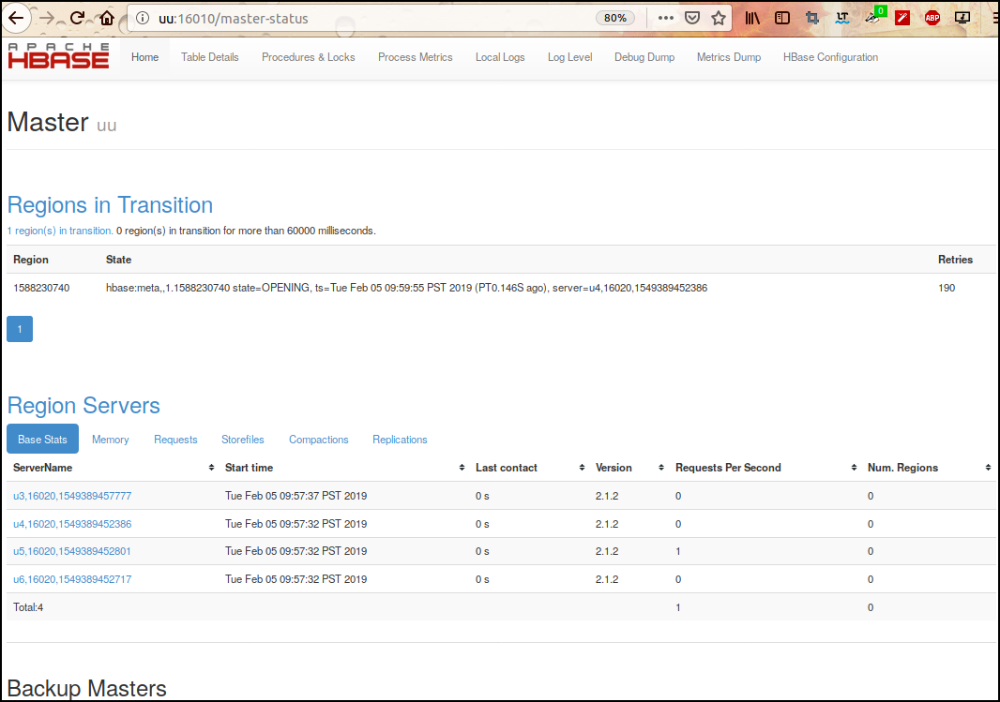

# HBase

## local mode

## cluster mode

- Start Zookeeper

```
ssh u3
zkServer.sh start
```

- Start hbase

```
start-hbase.sh
```

- Stop hbase

```
stop-hbase.sh
```





- troubleshoot

Fix `ClassNotFoundException: org.apache.htrace.SamplerBuilder`:
```
cd /opt/share/software/HadoopEcosystem/hbase/lib
cp client-facing-thirdparty/htrace-core-3.1.0-incubating.jar .
```

```
✘-1 /home/henry/share/software/HadoopEcosystem/hbase-2.1.2/lib/client-facing-thirdparty [master {origin/master}|✚ 1] 
22:17 # mv htrace-core4-4.2.0-incubating.jar htrace-core4-4.2.0-incubating.jar.bk
```


Ref:

http://www.techguru.my/database/hbase/install-hbase-2-x-with-hadoop-3-x/  
