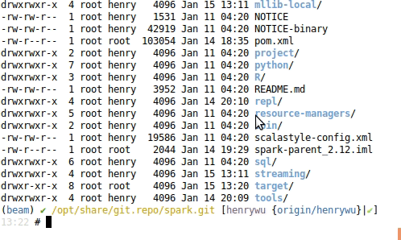

# set up a private could in home laptop

## Goal


## Machines


All qcow2 disk files are store in widnows 10. by sharing them with VMWARE, I can access it in ubuntu.

In ubuntu, install kvm and virutal machine manager, the vm configs are stored here:  
```
~/Desktop/HadoopEcosystem/libvirt
```


## Start/Stop/Setup all VMs

```
for i in `seq 1 7`; do virsh reboot u$i; sleep 60;done
for i in `seq 1 7`; do virsh shutdown u$i; sleep 60;done
for i in `seq 1 7`; do virsh start u$i;done

for i in `seq 0 7`; do 
ansible u$i -a "apt";
done
```


```
for i in `seq 0 7`; do
ansible u$i -a "ln -s /opt/share/vmshare/root/.bashrc /root/.bashrc.bk";
ansible u$i -a "mv -f /root/.bashrc.bk /root/.bashrc";
done

for i in `seq 0 7`; do
ansible u$i -a "ln -s /opt/share/vmshare/etc/hosts /etc/hosts.bk";
ansible u$i -a "mv -f /etc/hosts.bk /etc/hosts";
done
```


## Hadoop

```
13:09 # ll /opt/share/software/HadoopEcosystem/hadoop-3.1.1/
total 212
drwxr-xr-x 10 libvirt-qemu henry   4096 Jan  9 16:14 ./
drwxrwxr-x 14 libvirt-qemu henry   4096 Jan 15 04:28 ../
drwxr-xr-x  2 libvirt-qemu henry   4096 Aug  1 22:05 bin/
drwxr-xr-x  3 libvirt-qemu henry   4096 Aug  1 21:28 etc/
drwxr-xr-x  2 libvirt-qemu henry   4096 Aug  1 22:05 include/
drwxr-xr-x  3 libvirt-qemu henry   4096 Aug  1 22:05 lib/
drwxr-xr-x  4 libvirt-qemu henry   4096 Aug  1 22:05 libexec/
-rw-r--r--  1 libvirt-qemu henry 147144 Jul 28 16:13 LICENSE.txt
drwxrwxr-x  3 libvirt-qemu henry   4096 Jan  9 16:38 logs/
-rw-r--r--  1 libvirt-qemu henry  21867 Jul 28 16:13 NOTICE.txt
-rw-r--r--  1 libvirt-qemu henry   1366 Jul 28 13:41 README.txt
drwxr-xr-x  3 libvirt-qemu henry   4096 Aug  1 21:28 sbin/
drwxr-xr-x  4 libvirt-qemu henry   4096 Aug  1 22:17 share/
```

name node: u3  
data node: u4,u5,u6

### prepare for hadoop folders

```
for i in `seq 3 6`; do
ansible u$i -a "rm -fr /opt/hadoop";
done

for i in `seq 3 6`; do
ansible u$i -a "mkdir -p /opt/hadoop/data";
ansible u$i -a "mkdir -p /opt/hadoop/log";
ansible u$i -a "mkdir -p /opt/hadoop/tmp";
ansible u$i -a "mkdir -p /opt/hadoop/mr-history/tmp";
ansible u$i -a "mkdir -p /opt/hadoop/mr-history/done";
done

ansible u3 -a "mkdir -p /opt/hadoop/name";
```

### init namenode

```
$hdfs namenode -format
```

### start or stop hadoop cluster
Start:   

```bash
for i in `seq 3 6`; do virsh start u$i; done
sleep 60 # wait for 60 secs for servers to boot up
ansible u3 -a "start-all.sh";
ansible u3 -a "mapred --daemon start historyserver";
```

Stop:  
```
ansible u3 -a "mapred --daemon stop historyserver";
ansible u3 -a "stop-all.sh";
for i in `seq 3 6`; do virsh shutdown u$i; done
```

[http://u3:8088/cluster](http://u3:8088/cluster)  


[http://u3:9870/](http://u3:9870/)  


### Hadoop streaming

```
$find /opt/share/software/HadoopEcosystem/hadoop-3.1.1/ -name hadoop-streaming*.jar
/opt/share/software/HadoopEcosystem/hadoop-3.1.1/share/hadoop/tools/lib/hadoop-streaming-3.1.1.jar
/opt/share/software/HadoopEcosystem/hadoop-3.1.1/share/hadoop/tools/sources/hadoop-streaming-3.1.1-sources.jar
/opt/share/software/HadoopEcosystem/hadoop-3.1.1/share/hadoop/tools/sources/hadoop-streaming-3.1.1-test-sources.jar
```

```
hdfs dfs -rm -r wc_mr
export HADOOP_STREAMING_JAR=/opt/share/software/HadoopEcosystem/hadoop/share/hadoop/tools/lib/hadoop-streaming-3.1.1.jar
yarn jar $HADOOP_STREAMING_JAR -mapper 'wc -l' -numReduceTasks 0 -input /root/articles \
  -output wc-mr
```

## Spark

Build from source since I could not find spark for hadoop 3.1.1


For normal build this is fine:
```
./build/mvn -DskipTests clean package
```

I use this one:
```
./build/mvn \
  -Psparkr -Phive\
  -Phive-thriftserver -Pmesos -Pyarn \
  -Pkubernetes \
  -Phadoop-3.1 -Dhadoop.version=3.1.1 \
  -DskipTests clean package
```
hive seems not supporting hadoop 3, so remove it from the build command:
```
./build/mvn \
  -Psparkr \
  -Pmesos -Pyarn \
  -Pkubernetes \
  -Phadoop-3.1 -Dhadoop.version=3.1.1 \
  -DskipTests clean package
```





Run Spark with Yarn:  


REF: https://spark.apache.org/docs/latest/building-spark.html


```
java.lang.IllegalArgumentException: Unrecognized Hadoop major version number: 3.1.1
  at org.apache.hadoop.hive.shims.ShimLoader.getMajorVersion(ShimLoader.java:174)
  at org.apache.hadoop.hive.shims.ShimLoader.loadShims(ShimLoader.java:139)
  at org.apache.hadoop.hive.shims.ShimLoader.getHadoopShims(ShimLoader.java:100)
  at org.apache.hadoop.hive.conf.HiveConf$ConfVars.<clinit>(HiveConf.java:368)
  at org.apache.hadoop.hive.conf.HiveConf.<clinit>(HiveConf.java:105)
  at java.lang.Class.forName0(Native Method)
  at java.lang.Class.forName(Class.java:348)
  at org.apache.spark.util.Utils$.classForName(Utils.scala:195)
  at org.apache.spark.sql.SparkSession$.hiveClassesArePresent(SparkSession.scala:1116)
  at org.apache.spark.repl.Main$.createSparkSession(Main.scala:102)
  ... 57 elided
<console>:14: error: not found: value spark
       import spark.implicits._
              ^
<console>:14: error: not found: value spark
       import spark.sql
              ^
```

- Run spark

```
✔ /opt/share/git.repo/spark.git [henrywu {origin/henrywu}|✔] 
20:07 # SPARK_LOCAL_IP=192.168.122.1 ./bin/spark-shell --master yarn --deploy-mode client
...
Failed to find Spark jars directory (/home/henry/share/git.repo/spark.git/assembly/target/scala-2.11/jars).
You need to build Spark with the target "package" before running this program.
```
After running build:  
```
[INFO] ------------------------------------------------------------------------
[INFO] Reactor Summary for Spark Project Parent POM 3.0.0-SNAPSHOT:
[INFO] 
[INFO] Spark Project Parent POM ........................... SUCCESS [  5.922 s]
[INFO] Spark Project Tags ................................. SUCCESS [ 10.150 s]
[INFO] Spark Project Sketch ............................... SUCCESS [  9.611 s]
[INFO] Spark Project Local DB ............................. SUCCESS [  5.227 s]
[INFO] Spark Project Networking ........................... SUCCESS [ 10.297 s]
[INFO] Spark Project Shuffle Streaming Service ............ SUCCESS [ 11.854 s]
[INFO] Spark Project Unsafe ............................... SUCCESS [ 11.983 s]
[INFO] Spark Project Launcher ............................. SUCCESS [ 10.106 s]
[INFO] Spark Project Core ................................. SUCCESS [03:37 min]
[INFO] Spark Project ML Local Library ..................... SUCCESS [  7.181 s]
[INFO] Spark Project GraphX ............................... SUCCESS [ 12.523 s]
[INFO] Spark Project Streaming ............................ SUCCESS [ 31.369 s]
[INFO] Spark Project Catalyst ............................. SUCCESS [01:46 min]
[INFO] Spark Project SQL .................................. SUCCESS [03:21 min]
[INFO] Spark Project ML Library ........................... SUCCESS [01:47 min]
[INFO] Spark Project Tools ................................ SUCCESS [  0.577 s]
[INFO] Spark Project Hive ................................. SUCCESS [ 43.242 s]
[INFO] Spark Project REPL ................................. SUCCESS [  4.809 s]
[INFO] Spark Project YARN Shuffle Service ................. SUCCESS [ 10.514 s]
[INFO] Spark Project YARN ................................. SUCCESS [ 10.361 s]
[INFO] Spark Project Mesos ................................ SUCCESS [  6.854 s]
[INFO] Spark Project Kubernetes ........................... SUCCESS [  8.368 s]
[INFO] Spark Project Assembly ............................. SUCCESS [  3.979 s]
[INFO] Spark Integration for Kafka 0.10 ................... SUCCESS [  7.962 s]
[INFO] Kafka 0.10+ Source for Structured Streaming ........ SUCCESS [ 11.423 s]
[INFO] Spark Project Examples ............................. SUCCESS [ 16.907 s]
[INFO] Spark Integration for Kafka 0.10 Assembly .......... SUCCESS [ 10.350 s]
[INFO] Spark Avro ......................................... SUCCESS [  4.265 s]
[INFO] ------------------------------------------------------------------------
[INFO] BUILD SUCCESS
[INFO] ------------------------------------------------------------------------
[INFO] Total time:  14:59 min
[INFO] Finished at: 2019-01-15T16:48:36-08:00
[INFO] ------------------------------------------------------------------------
```

### Troubleshooting

```
2019-01-15 22:49:05,733 INFO org.apache.hadoop.yarn.server.resourcemanager.RMAppManager$ApplicationSummary: appId=application_1547609798272_0001,name=Spark shell,user=root,queue=default,state=FINISHED,trackingUrl=http://u3:8088/proxy/application_1547609798272_0001/,appMasterHost=192.168.122.105,submitTime=1547610447422,startTime=1547610448573,finishTime=1547610545418,finalStatus=UNDEFINED,memorySeconds=96574,vcoreSeconds=94,preemptedMemorySeconds=0,preemptedVcoreSeconds=0,preemptedAMContainers=0,preemptedNonAMContainers=0,preemptedResources=<memory:0\, vCores:0>,applicationType=SPARK,resourceSeconds=96574 MB-seconds\, 94 vcore-seconds,preemptedResourceSeconds=0 MB-seconds\, 0 vcore-seconds
```

Found this in data node log:

```
2019-01-15 23:10:35,348 WARN org.apache.hadoop.yarn.server.nodemanager.containermanager.monitor.ContainersMonitorImpl: Container [pid=2313,containerID=container_1547609798272_0002_01_000001] is running 15301120B beyond the 'VIRTUAL' memory limit. Current usage: 151.0 MB of 1 GB physical memory used; 2.1 GB of 2.1 GB virtual memory used. Killing container.
Dump of the process-tree for container_1547609798272_0002_01_000001 :
>.|- PID PPID PGRPID SESSID CMD_NAME USER_MODE_TIME(MILLIS) SYSTEM_TIME(MILLIS) VMEM_USAGE(BYTES) RSSMEM_USAGE(PAGES) FULL_CMD_LINE
>.|- 2313 2311 2313 2313 (bash) 0 1 21856256 874 /bin/bash -c /opt/share/software/jdk1.8.0_191/bin/java -server -Xmx512m -Djava.io.tmpdir=/opt/hadoop/tmp/nm-local-dir/usercache/root/appcache/application_1547609798272_0002/container_1547609798272_0002_01_000001/tmp -Dspark.yarn.app.container.log.dir=/opt/hadoop/log/userlogs/application_1547609798272_0002/container_1547609798272_0002_01_000001 org.apache.spark.deploy.yarn.ExecutorLauncher --arg '192.168.122.1:33869' --properties-file /opt/hadoop/tmp/nm-local-dir/usercache/root/appcache/application_1547609798272_0002/container_1547609798272_0002_01_000001/__spark_conf__/__spark_conf__.properties --dist-cache-conf /opt/hadoop/tmp/nm-local-dir/usercache/root/appcache/application_1547609798272_0002/container_1547609798272_0002_01_000001/__spark_conf__/__spark_dist_cache__.properties 1> /opt/hadoop/log/userlogs/application_1547609798272_0002/container_1547609798272_0002_01_000001/stdout 2> /opt/hadoop/log/userlogs/application_1547609798272_0002/container_1547609798272_0002_01_000001/stderr.
>.|- 2322 2313 2313 2313 (java) 652 405 2248302592 37786 /opt/share/software/jdk1.8.0_191/bin/java -server -Xmx512m -Djava.io.tmpdir=/opt/hadoop/tmp/nm-local-dir/usercache/root/appcache/application_1547609798272_0002/container_1547609798272_0002_01_000001/tmp -Dspark.yarn.app.container.log.dir=/opt/hadoop/log/userlogs/application_1547609798272_0002/container_1547609798272_0002_01_000001 org.apache.spark.deploy.yarn.ExecutorLauncher --arg 192.168.122.1:33869 --properties-file /opt/hadoop/tmp/nm-local-dir/usercache/root/appcache/application_1547609798272_0002/container_1547609798272_0002_01_000001/__spark_conf__/__spark_conf__.properties --dist-cache-conf /opt/hadoop/tmp/nm-local-dir/usercache/root/appcache/application_1547609798272_0002/container_1547609798272_0002_01_000001/__spark_conf__/__spark_dist_cache__.properties.
```

REF:  
https://stackoverflow.com/questions/51237116/understanding-spark-yarn-executor-memoryoverhead  
https://stackoverflow.com/questions/49988475/why-increase-spark-yarn-executor-memoryoverhead  
https://spark.apache.org/docs/latest/configuration.html  


SPARK_LOCAL_IP=192.168.122.1 ./bin/spark-shell --master yarn --deploy-mode client --driver-memory 1G --executor-memory 1G --conf spark.executor.memoryOverhead=348


https://mapr.com/blog/best-practices-yarn-resource-management/  
https://blog.csdn.net/dai451954706/article/details/48828751  
```
    <property>
        <name>yarn.nodemanager.vmem-check-enabled</name>
        <value>false</value>
    </property>   
```


- upload file failed from webui

found this in namenode log:
```
2019-01-15 23:21:35,253 INFO org.apache.hadoop.ipc.Server: IPC Server handler 2 on 9000, call Call#936 Retry#0 org.apache.hadoop.hdfs.protocol.ClientProtocol.create from 192.168.122.106:56178: org.apache.hadoop.security.AccessControlException: Permission denied: user=dr.who, access=WRITE, inode="/test":root:supergroup:drwxr-xr-x
```

## Beam


## Zookeeper

in u3 running in port 2181

## HBase


http://www.techguru.my/database/hbase/install-hbase-2-x-with-hadoop-3-x/  
```
✘-1 /home/henry/share/software/HadoopEcosystem/hbase-2.1.2/lib/client-facing-thirdparty [master {origin/master}|✚ 1] 
22:17 # mv htrace-core4-4.2.0-incubating.jar htrace-core4-4.2.0-incubating.jar.bk
```


## Flink


## Others

stop services from auto-start:

```
for i in `seq 3 6`; do
ansible u$i -a "update-rc.d -f mysql remove";
ansible u$i -a "update-rc.d -f nginx remove";
ansible u$i -a "update-rc.d -f postgresql remove";
done
```

REF: https://help.ubuntu.com/community/UbuntuBootupHowto
