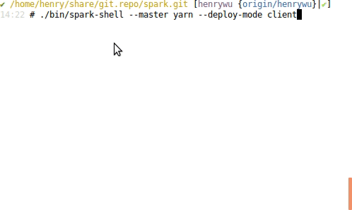

# set up a private could in home laptop

## Goal


## Machines


All qcow2 disk files are store in widnows 10. by sharing them with VMWARE, I can access it in ubuntu.

In ubuntu, install kvm and virutal machine manager, the vm configs are stored here:  
```
~/Desktop/HadoopEcosystem/libvirt
```


## Start/Stop/Setup all VMs

```
for i in `seq 1 7`; do virsh reboot u$i; sleep 60;done
for i in `seq 1 7`; do virsh shutdown u$i; sleep 60;done
for i in `seq 1 7`; do virsh start u$i;done

for i in `seq 0 7`; do 
ansible u$i -a "apt";
done
```


```
for i in `seq 0 7`; do
ansible u$i -a "ln -s /opt/share/vmshare/root/.bashrc /root/.bashrc.bk";
ansible u$i -a "mv -f /root/.bashrc.bk /root/.bashrc";
done

for i in `seq 0 7`; do
ansible u$i -a "ln -s /opt/share/vmshare/etc/hosts /etc/hosts.bk";
ansible u$i -a "mv -f /etc/hosts.bk /etc/hosts";
done
```


## Hadoop

```
13:09 # ll /opt/share/software/HadoopEcosystem/hadoop-3.1.1/
total 212
drwxr-xr-x 10 libvirt-qemu henry   4096 Jan  9 16:14 ./
drwxrwxr-x 14 libvirt-qemu henry   4096 Jan 15 04:28 ../
drwxr-xr-x  2 libvirt-qemu henry   4096 Aug  1 22:05 bin/
drwxr-xr-x  3 libvirt-qemu henry   4096 Aug  1 21:28 etc/
drwxr-xr-x  2 libvirt-qemu henry   4096 Aug  1 22:05 include/
drwxr-xr-x  3 libvirt-qemu henry   4096 Aug  1 22:05 lib/
drwxr-xr-x  4 libvirt-qemu henry   4096 Aug  1 22:05 libexec/
-rw-r--r--  1 libvirt-qemu henry 147144 Jul 28 16:13 LICENSE.txt
drwxrwxr-x  3 libvirt-qemu henry   4096 Jan  9 16:38 logs/
-rw-r--r--  1 libvirt-qemu henry  21867 Jul 28 16:13 NOTICE.txt
-rw-r--r--  1 libvirt-qemu henry   1366 Jul 28 13:41 README.txt
drwxr-xr-x  3 libvirt-qemu henry   4096 Aug  1 21:28 sbin/
drwxr-xr-x  4 libvirt-qemu henry   4096 Aug  1 22:17 share/
```

name node: u3  
data node: u4,u5,u6

### prepare for hadoop folders

```
for i in `seq 3 6`; do
ansible u$i -a "rm -fr /opt/hadoop";
done

for i in `seq 3 6`; do
ansible u$i -a "mkdir -p /opt/hadoop/data";
ansible u$i -a "mkdir -p /opt/hadoop/log";
ansible u$i -a "mkdir -p /opt/hadoop/tmp";
ansible u$i -a "mkdir -p /opt/hadoop/mr-history/tmp";
ansible u$i -a "mkdir -p /opt/hadoop/mr-history/done";
done

ansible u3 -a "mkdir -p /opt/hadoop/name";
```

### init namenode

```
$hdfs namenode -format
```

### start or stop hadoop cluster
Start:   

```bash
for i in `seq 3 6`; do virsh start u$i; done
sleep 60 # wait for 60 secs for servers to boot up
ansible u3 -a "start-all.sh";
ansible u3 -a "mapred --daemon start historyserver";
```

Stop:  
```
ansible u3 -a "mapred --daemon stop historyserver";
ansible u3 -a "stop-all.sh";
for i in `seq 3 6`; do virsh shutdown u$i; done
```

http://u3:8088/cluster  


## Spark

Build from source since I could not find spark for hadoop 3.1.1


For normal build this is fine:
```
./build/mvn -DskipTests clean package
```

I use this one:
```
./build/mvn \
  -Psparkr -Phive \
  -Pkubernetes \
  -Phive-thriftserver -Pmesos -Pyarn \
  -Phadoop-3.1 -Dhadoop.version=3.1.1 \
  -DskipTests clean package
```


Run Spark with Yarn:  


REF: https://spark.apache.org/docs/latest/building-spark.html


## Beam


## Flink


