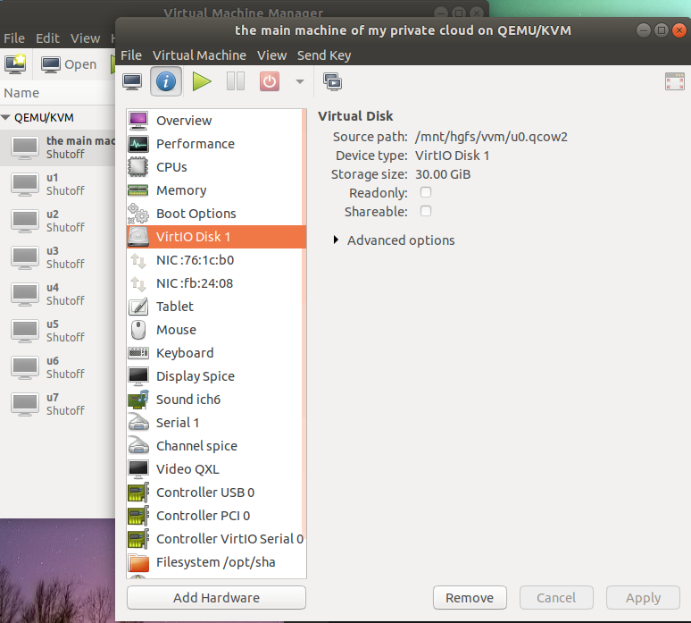

# set up a private could in home laptop

## Goal


## Machines




All qcow2 disk files are store in widnows 10. by sharing them with VMWARE, I can access it in ubuntu.

In ubuntu, install kvm and virutal machine manager, the vm configs are stored here:  
```
~/Desktop/HadoopEcosystem/libvirt
```


## Start all VMs

```
for i in `seq 1 7`; do virsh reboot u$i; sleep 60;done
for i in `seq 1 7`; do virsh shutdown u$i; sleep 60;done
for i in `seq 1 7`; do virsh start u$i; sleep 60;done

for i in `seq 0 7`; do 
ansible u$i -a "apt";
done
```

```
for i in `seq 0 7`; do
ansible u$i -a "cp /etc/network/interfaces /opt/share/vmshare/etc/network/interfaces.$i.conf";
done
```
for i in `seq 1 7`; do
ansible u$i -a "rm -f /etc/network/interfaces";
ansible u$i -a "cp /opt/share/vmshare/etc/network/interfaces.$i.conf /etc/network/interfaces";
done

for i in `seq 0 7`; do
ansible u$i -a "ln -s /opt/share/vmshare/etc/network/interfaces.$i.conf /etc/network/interfaces.bk";
ansible u$i -a "mv -f /etc/network/interfaces.bk /etc/network/interfaces";
done

for i in `seq 0 7`; do
ansible u$i -a "ln -s /opt/share/vmshare/root/.bashrc /root/.bashrc.bk";
ansible u$i -a "mv -f /root/.bashrc.bk /root/.bashrc";
done

for i in `seq 0 7`; do
ansible u$i -a "ln -s /opt/share/vmshare/etc/hosts /etc/hosts.bk";
ansible u$i -a "mv -f /etc/hosts.bk /etc/hosts";
done


## Hadoop

name node: u3
data node: u4,u5,u6

```

for i in `seq 3 6`; do
ansible u$i -a "rm -fr /opt/hadoop";
done

for i in `seq 3 6`; do
ansible u$i -a "mkdir -p /opt/hadoop/data";
ansible u$i -a "mkdir -p /opt/hadoop/log";
ansible u$i -a "mkdir -p /opt/hadoop/tmp";
ansible u$i -a "mkdir -p /opt/hadoop/mr-history/tmp";
ansible u$i -a "mkdir -p /opt/hadoop/mr-history/done";
done

ansible u3 -a "mkdir -p /opt/hadoop/name";

[616][u3][0][-bash](18:14:43)[0](root) : /opt/hadoop
$hdfs namenode -format

mapred --daemon start historyserver

for i in `seq 3 6`; do virsh shutdown u$i; done
```

Start:  
```
for i in `seq 3 6`; do virsh start u$i; done
ansible u3 -a "start-all.sh";
```
